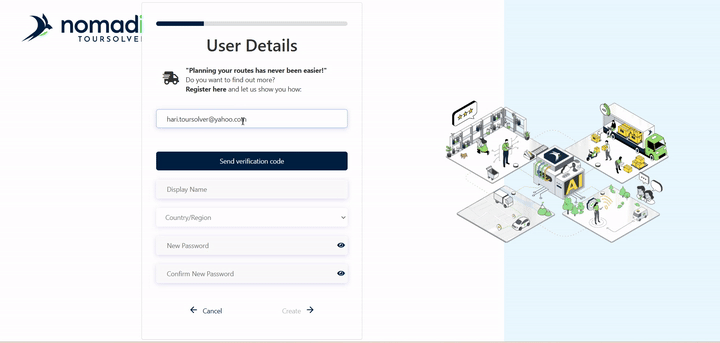
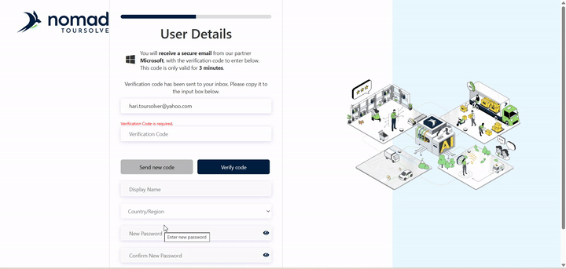
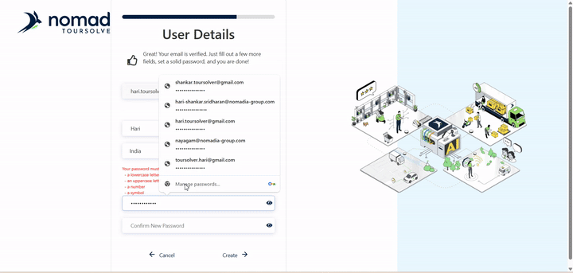
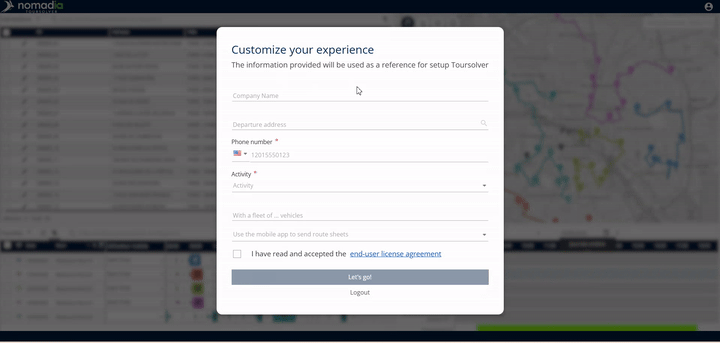
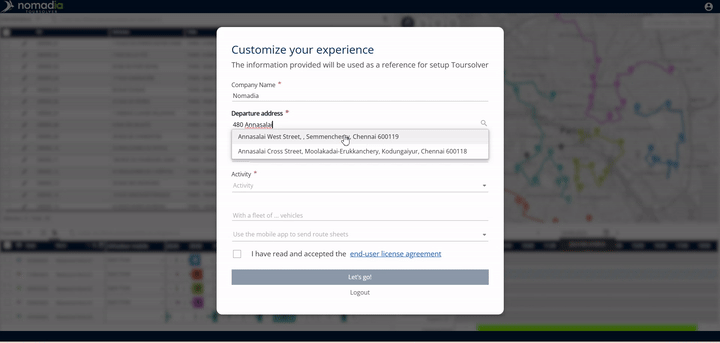
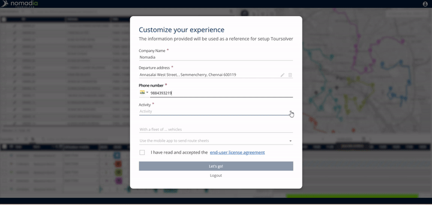
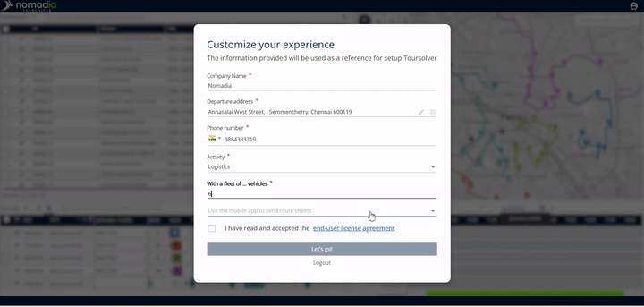
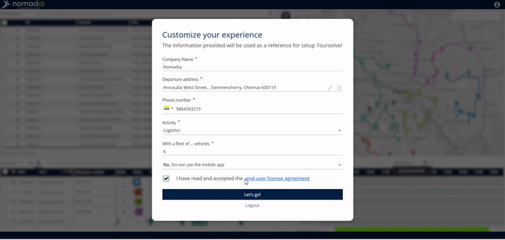

# GettingStarted-SignupProcess

This comprehensive guide is designed to walk you through creating your new TwoSolver account in the Test Environment. We believe in getting you up and running quickly and easily, ensuring a pleasant start to your experience!

***

## 1. Friendly Introduction

Welcome to TwoSolver! We are delighted you are here. This guide will provide clear, step-by-step instructions for signing up for your **TwoSolver trial account** in the Test Environment. By following these steps, you will quickly create your credentials and gain initial access to the platform.

***

## 2. Getting Started

Creating your account involves three main stages: verifying your email, setting your profile details, and finalizing your company setup.

### System Requirements

The provided sources focus exclusively on the registration process and do not specify any system requirements (hardware or software) necessary for using the TwoSolver platform.

### Installation/Setup Steps

Since the TwoSolver Test Environment is an online platform, there are no separate installation steps required. You will begin immediately with the Signup Process.

### Initial Configuration: Creating Your Account

### Step A: Verify Your Email Address

This first crucial step verifies your identity and secures your new account.

    *   **Expected Outcome:** Once successful, you will see a confirmation message stating, "your email has been verified".

### Step B: Setting Your Profile Details

Now you will establish your personal login credentials.

1.  **Fill in Details:** Fill in your basic profile details, including your **Name** and **Country**.
2.  **Create Your Password:** Enter your chosen password.
    *   ⚠️ **Warning: Password Requirements**
        Your password must be strong! Ensure it includes all of the following:
        *   At least one uppercase letter
        *   At least one lowercase letter
        *   A number
        *   A special character
3.  **Continue:** Click **Create** to proceed.

### Step C: Completing the Onboarding Page

After creating your profile, you will automatically reach the Onboarding Page to enter necessary company information.

    *   *Visual Guidance Note:* (Screenshot/Diagram 3: Onboarding page input fields for company details and vehicle count.)

### Step D: Final Setup and Login

The final stage ensures you accept the terms before gaining access.

1.  **Review Agreement:** Before moving forward, you must review the **end user license agreement** (EULA).

***

## 3. Feature Explanations with Benefits

Once you complete the signup process, your TwoSolver Trial account is ready.

The benefit of the Trial account is that it allows you to test the platform immediately.

However, please **note that the trial account comes with limitations**. For instance, you will be limited to **up to 250 visits per optimization**. To unlock the full capabilities and access the complete feature set, you will eventually need to switch to the production version.

***

## 4. Common Tasks

### Logging In for the First Time

To ensure your newly created credentials work correctly, it is recommended practice to log out immediately and log back in.

1.  **Log Out:** Log out of the system.
2.  **Log Back In:** Log back in using the email and password you just created to verify your credentials are functional.

### Handling Existing Accounts (Troubleshooting)

If you attempt to sign up using an email address that is already registered in the system, you will receive a specific message.

*   **Error Message:** "A user with the specified ID already exist. Please choose the different one".
    *   *Visual Guidance Note:* (Screenshot/Diagram 4: Error message displayed when using an existing email address.)

***

## 5. Productivity Tips

💡 **Tip: Check Your Login Immediately**
After the final setup, log out and log back in to confirm that your new credentials are saved and working correctly, ensuring a smooth start.

⚠️ **Warning: Account Access Limitations**
Remember that the account you just created is a trial account and has functional limitations, such as a limit of 250 visits per optimization. Planning for full access requires transitioning to the production version.

💡 **Tip: Use Simple Actions for Quick Tasks**

