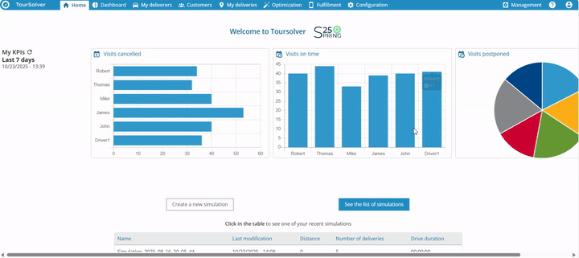
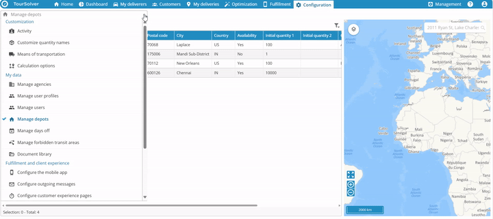
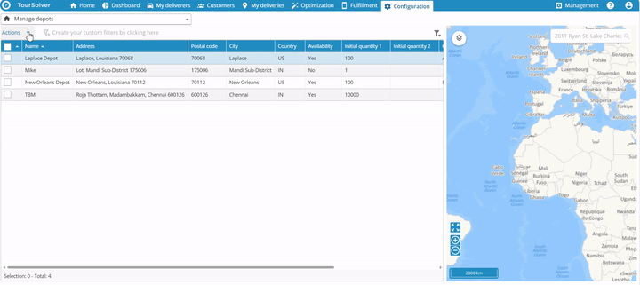
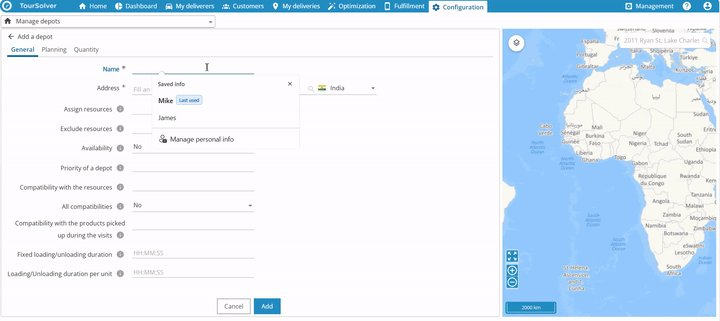
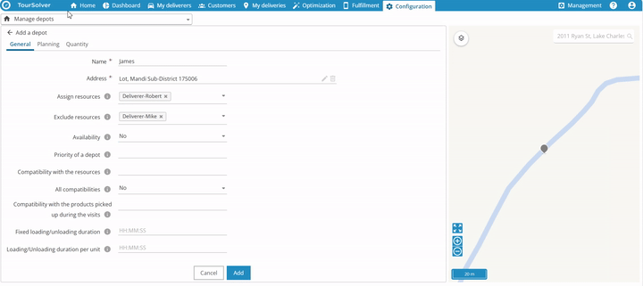
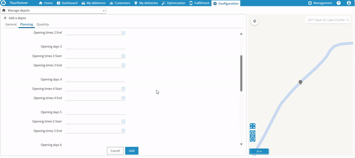
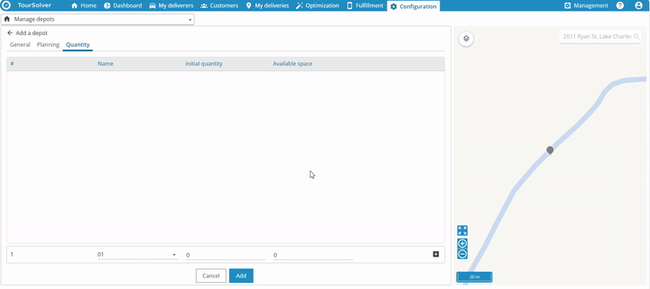
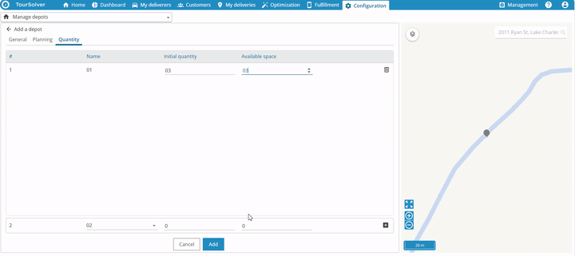
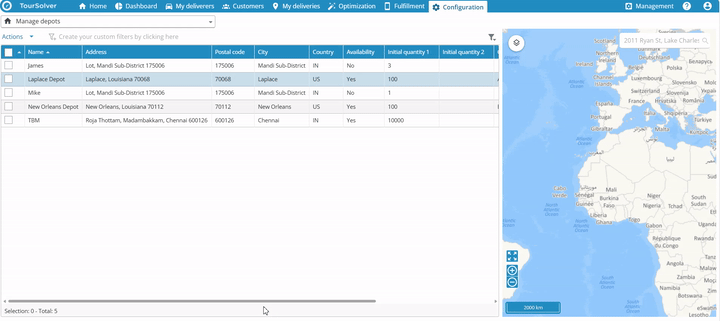
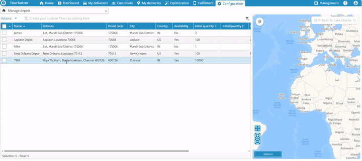

# ImportandDatasetup-CreateaDepot

This is a fantastic request! Creating clear, step-by-step documentation is key to ensuring everyone, regardless of technical background, can succeed. We will build a user-friendly guide for creating and managing Depots in the ToolSolver web application, using the precise information and formatting rules provided in the sources.

***

# Comprehensive User Guide: Creating and Managing Depots

Welcome! We are excited to help you start using the ToolSolver web application to set up your Depots. A Depot is essentially a location—a warehouse, service center, or hub—that you need to manage for scheduling and resource allocation. By following this guide, you will learn exactly how to create these important locations efficiently and accurately.

Our goal is to make this process productive, insightful, and remarkably pleasant!

## 1. Getting Started: Accessing Depot Management

Before you can create a new Depot, you need to navigate to the correct management screen within the ToolSolver web application.

### System Requirements & Installation
*(Please note: The provided sources focus exclusively on the configuration steps within the existing ToolSolver web application. Therefore, we do not have specific information regarding system requirements or installation procedures.)*

### Initial Configuration: Finding the Management Screen

To begin managing or creating a Depot, follow these steps:

1.  Access the **ToolSolver web application**.

***

## 2. Feature Explanations: Understanding Depot Details

When you create a new Depot, you will fill out details across three main sections: **General**, **Planning**, and **Quantity**. Each section controls a different aspect of how the Depot functions within your scheduling and resource planning.

### A. General Section
This section handles the basic identification and core rules for your Depot.

| Field/Constraint | Purpose/Benefit |
| :--- | :--- |
| **Name** | Identifying label for the Depot. |
| **Address** | Physical location of the Depot. |
| **Constraints** | Rules that govern how the Depot operates, such as **Assign Resources**, **Explore Resources**, or **Availability**. |

### B. Planning Section
This section defines when the Depot is operational.

*   You can specify the **opening days**.
*   You can set the **opening time**.
*   You can set the specific **start and end time**.
*   You have the option to edit **multiple opening days** from this location.

### C. Quantity Section
This section defines the capacity and inventory available at the location.

*   You will edit the **initial quantity**.
*   You can define the **available space**.

***

## 3. Common Tasks: Creating a New Depot

The most common task is adding a brand new Depot. This requires moving through the three detailed sections described above.

### Step-by-Step: Adding a New Depot

2.  In the **General** section, enter the required basic information.
    *   Input the **Name** and **Address**.

4.  Edit the scheduling details.
    *   Adjust the **opening days** and **opening time**.
    *   Define the **start and end time**.
    *   💡 **Tip**: You can also edit **multiple opening days** from this screen to save time when setting complex schedules.

6.  To add or edit quantity details, tap the **plus symbol** located at the bottom right corner.
7.  Update the inventory details.
    *   Edit the **initial quantity**.

***

## 4. Productivity Tips

To manage your Depots efficiently, especially if you have a large number of locations to configure, leverage the bulk action tools.

### Bulk Import or Export Depots

You can easily manage multiple Depot entries at once using the import and export functions.

1.  On the main Depot management screen, click the **Actions** menu.

> 💡 **Tip**: Using the **Export** feature first can be helpful if you want to create a template to correctly format the data before performing a bulk **Import** of new Depots.

