# ImportandDataSetup-CreateandModifyaUser

Greetings! It is my pleasure to help you create this comprehensive user guide for managing your team's access. We are dedicated to making sure this process is clear, simple, and confidence-building.

This guide will walk you through everything you need to know about creating a brand-new user and modifying an existing user based on the features available in the application.

***

# Comprehensive User Guide: Create and Modify a User

## 1. Friendly Introduction

Welcome! Managing user accounts is essential for ensuring your team has the right access to do their jobs effectively. This guide provides step-by-step instructions for setting up new team members and updating the details, roles, or schedules of current users. By following these simple steps, you will be able to manage access settings confidently and efficiently!

## 2. Getting Started: Navigating to User Management

The first step for creating or modifying any user is accessing the main configuration area from the homepage.

### Initial Navigation

To begin creating or modifying a user, follow these steps:

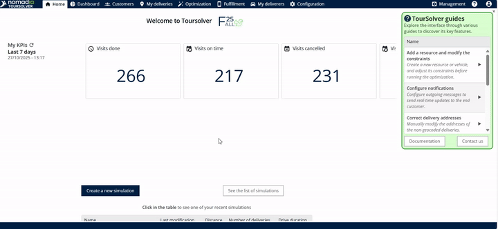

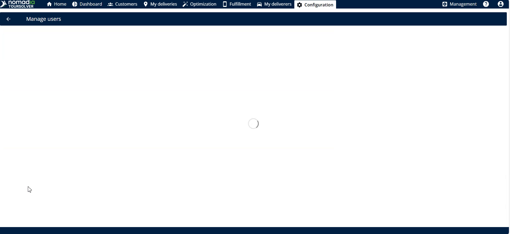

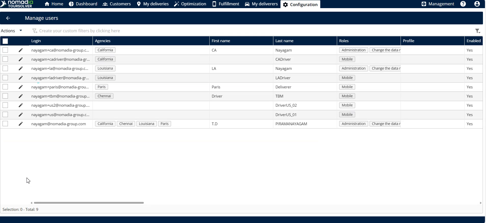

## 3. Feature Explanations and Benefits

When you create or modify a user, you will interact with several key sections to define their access and scheduling.

| Section | Purpose (Context) | Key Actions |
| :--- | :--- | :--- |
| **Access** | Defines the basic identity and login permissions (web and mobile) for the user. | Enter login ID, names, and set the initial password. |
| **Roles and Rights** | Determines what the user is allowed to see and do within the application (e.g., administrator, optimization). | Enable necessary roles and rights, such as **administrator** or **optimization**. |
| **Agencies** | Assigns the specific agencies the user is responsible for or needs access to. | Select required agencies and use the **right arrow** to assign them. |
| **Planning** | Allows you to plan the slot time for the user. | Tap the day and timing to set the slot time, then tap **update**. |
| **Days Off** | Enables you to pre-plan and record any days off the user intends to take. | Enter the **from date** and **to date** for the planned time off. |

## 4. Common Tasks with Detailed Steps

You have the ability to create a user completely from scratch or efficiently modify an existing user by using their details as a template.

### Task A: Create a User from Scratch

This is necessary when onboarding a new employee who requires a unique login ID and defined roles.

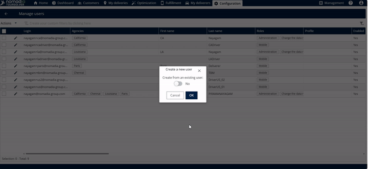

2.  **Fill in Access Details:** In the **Access** section, enter the required information:
    *   **Login ID**
    *   **First Name**
    *   **Last Name**
3.  **Set Access Type and Password:**
    *   For web access, **toggle** the **Web Access** option.
    *   For mobile access, **toggle** the **Mobile Access** option.
    *   Enter the password.
    💡 **Tip:** You can toggle both the **Web Access** and **Mobile Access** options at the same time if the user requires both.
    ⚠️ **Warning (Password Requirement):** The password must contain **8 characters**, including **one numeric** character and **one special character**.

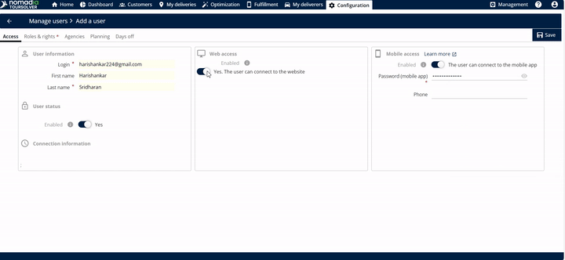

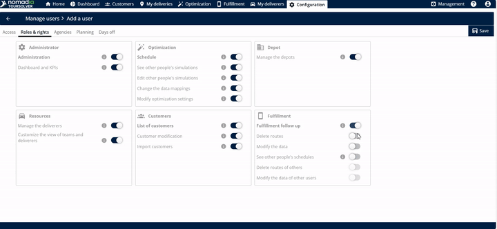

7.  **Schedule Days Off (Optional):** In the **Days Off** section, you can plan future time off:
    *   Tap the **plus icon** on the right side.
    *   Enter the **from date** and the **to date** for the day off.

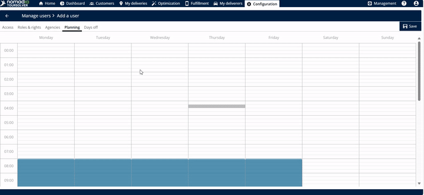

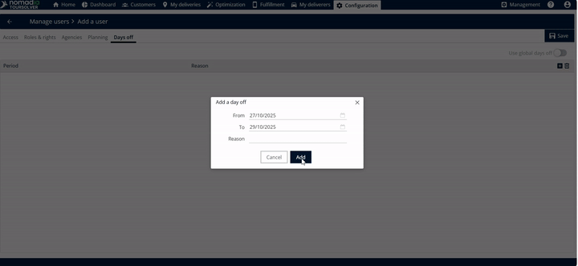

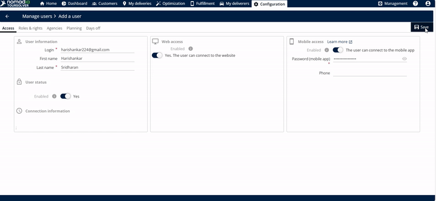

### Task B: Modify an Existing User

You can easily update an existing user's information, such as their roles, agencies, or schedule, without starting over.

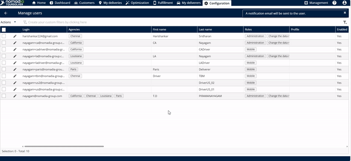

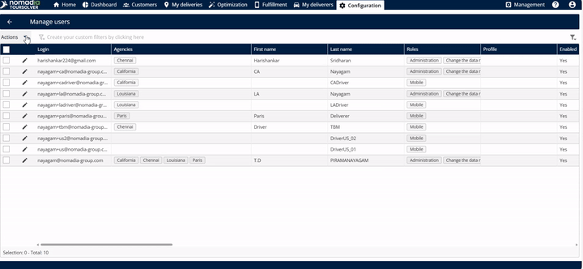

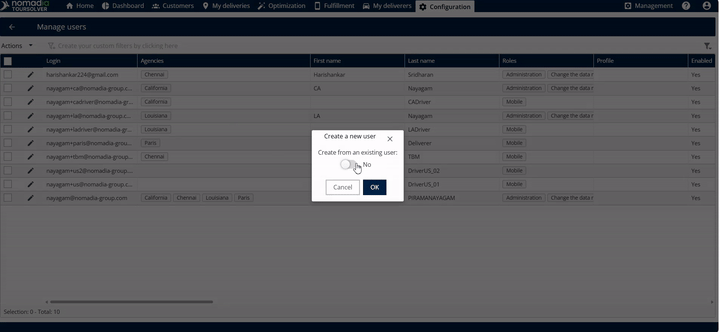

4.  **Modify Information:** Go through the different sections (Access, Roles and Rights, Planning, etc.) and modify the existing information as needed.

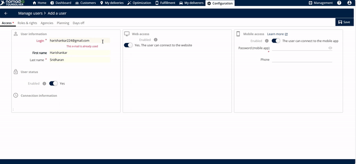

## 5. Productivity Tips

Here are a few useful tips and warnings to ensure your user management process goes smoothly:

*   💡 **Dual Access:** Remember that you can enable both **web access** and **mobile access** simultaneously for a user, giving them flexibility in how they interact with the system.
*   ⚠️ **Password Clarity:** When setting a password, make sure it meets the security criteria: it must be **8 characters** long and include at least **one numeric** character and **one special character**.
*   ⚠️ **Avoid Duplicate Emails:** If you try to enter an email address that is already in use by another user, the system will display an error message stating that **"the email id is already used"**. You will need to use a unique email address to proceed.

