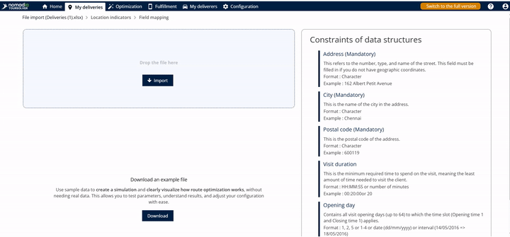
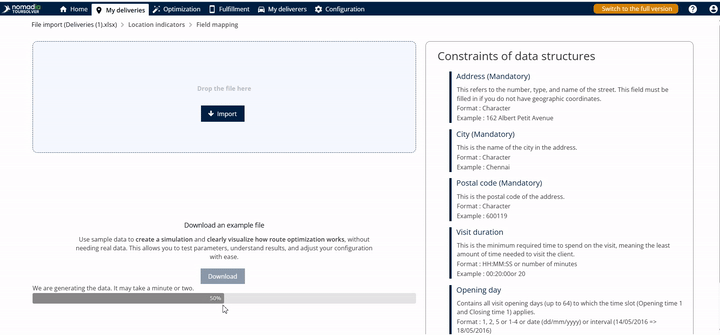
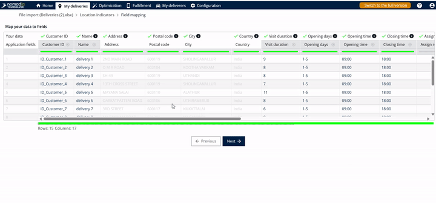
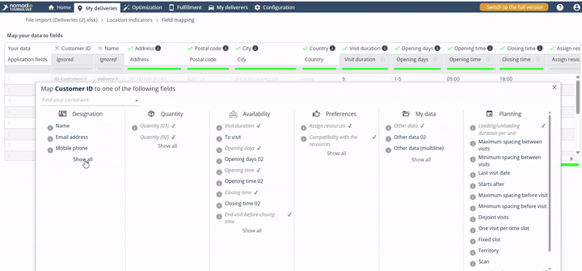
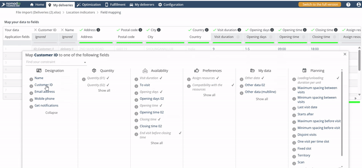
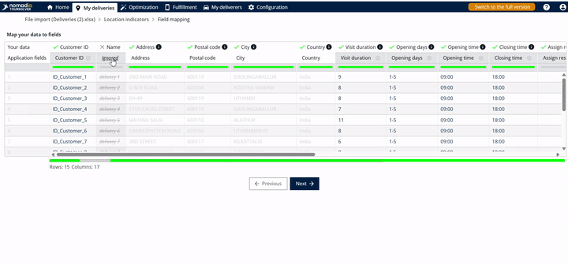
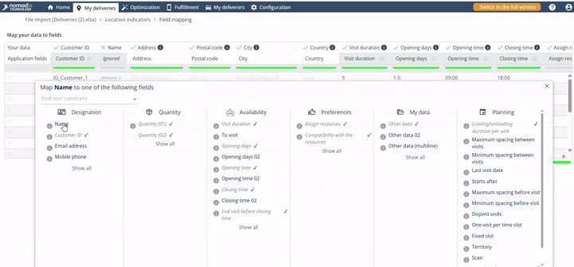
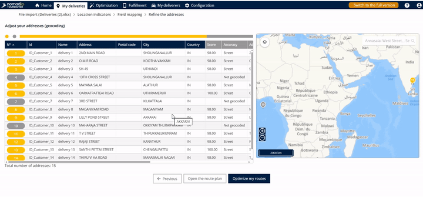
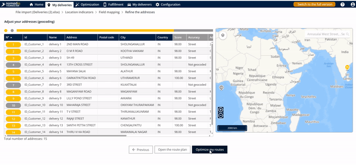
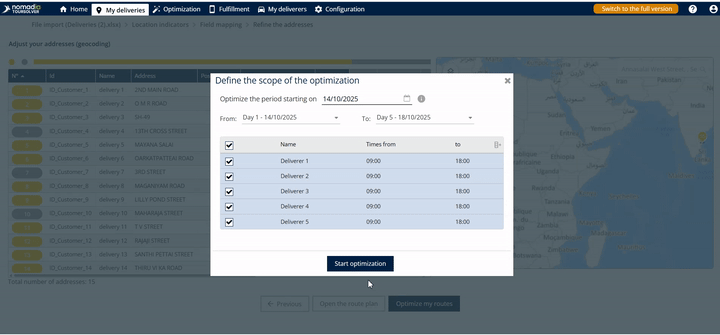

# ImportandDataSetup-ImportofDeliveries

# 📘 Comprehensive User Guide: Importing Deliveries

Welcome! This guide is designed to make importing your delivery data into the server a smooth and successful experience. We focus on clear, simple steps so you can quickly get your routes optimized and moving!

***

## 1. Friendly Introduction

The **Import of Deliveries** tool allows you to upload a list of addresses and customer information directly into the system for viewing and route optimization. By following these easy steps, you will match your spreadsheet columns to the required system fields, visualize the locations on a map, and begin optimizing your delivery routes.

***

## 2. Getting Started

### Initial Configuration: Accessing the Import Area

To begin importing your deliveries, you first need to navigate to the correct reporting area.

1.  From the main menu, go to **Deliveries**.
2.  You are now ready to access the Delivery Report interface.

### Downloading Sample Data

If you are unsure how to format your Excel file, you can download a sample template. Using the sample data ensures your file is ready for import immediately.

1.  Tap on **download**.

💡 **Tip:** Always use the sample data provided if you are new to the system structure. This often reduces potential mapping errors later on!

***

## 3. Feature Explanations with Benefits

The import process includes several key steps that help ensure your data is accurately prepared for route planning:

| Feature | Context and Benefit |
| :--- | :--- |
| **Data Mapping** | This ensures that the column headings in your uploaded spreadsheet (like "Cust ID" or "Client Name") are correctly matched to the fields the server uses. This precise matching is crucial for accurate routing. |
| **Geocoding Colors** | After importing, the system automatically tries to find the precise location (geocode) of each delivery address. Colors indicate success or failure, allowing you to quickly spot and correct errors. |
| **Route Optimization** | This is the final step where the system calculates the most efficient order and path for your imported deliveries. |

### Understanding Geocoding Status

When the map view appears, colors guide you to understand if your addresses were successfully located (geocoded):

")

")

***

## 4. Common Tasks: Importing Deliveries and Optimizing Routes

This task covers the process of uploading your delivery data, verifying field matching, and initiating route planning.

### Task: Importing Data and Mapping Fields

You need to tell the system which columns in your spreadsheet correspond to the system’s fields (like Customer ID or Name).

3.  If a field is already matched correctly (as happens if you use the test link), you can skip mapping for that field.
4.  **To reset or adjust a field mapping** (using Customer ID and Name as an example):

### Task: Reviewing Data and Optimizing Routes

After confirming the data mapping, you can proceed to the map view and start planning.

3.  Review the locations and their colors.
    *   ⚠️ **Warning:** If you see **Gray** locations, those addresses were not found by the system. You may need to review and correct those addresses in your original data before optimizing the route for accuracy.

***

## 5. Productivity Tips

Here are a few ways to make your data import faster and more accurate:

*   💡 **Prioritize Yellow:** When reviewing the map view, you know that yellow locations are reliable (geocoded at the sheet level). Focus your attention on any locations marked **Gray**.
*   💡 **Master Mapping Efficiency:** If you need to quickly change how a field is matched, remember you can choose to **ignore** the current mapping and then select the correct field name immediately. This is quicker than correcting the data in your spreadsheet outside of the system.
*   💡 **Know Your Path:** The entire process is designed to flow logically: Deliveries $\rightarrow$ Import $\rightarrow$ Map $\rightarrow$ Next $\rightarrow$ Optimize. Always follow this sequence for a guaranteed successful import and optimization.

