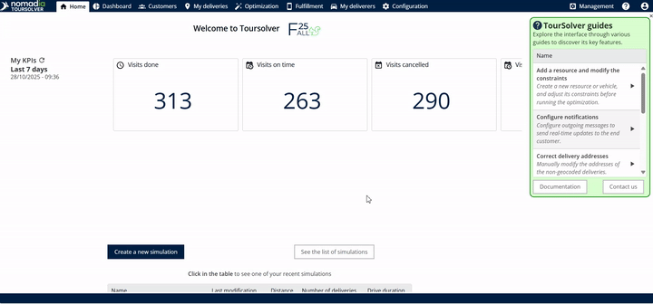
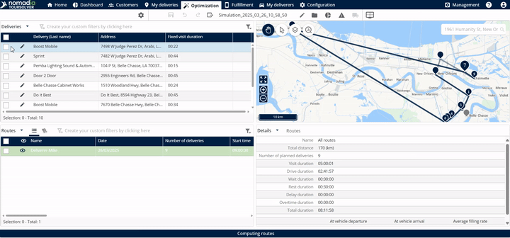
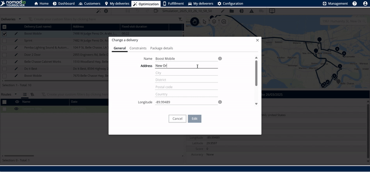
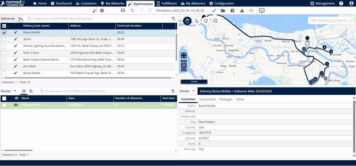

# Importanddatasetup-ModifyAddressofaDelivery

Hello! I am delighted to help you create a comprehensive and easy-to-follow guide for modifying delivery address information. Our goal is to make sure you feel completely confident navigating this process.

This user guide focuses specifically on the task **\[ModifyAddressInformationofaDelivery]** and uses clear, straightforward language to ensure your success.

---

## 1. Friendly Introduction

Welcome! This guide shows you exactly how to update the address for an existing delivery and ensure your routes are instantly updated [0:00–0:05].

Modifying an address and re-optimizing your route is a simple process that ensures your drivers always have the most accurate information, leading to efficient deliveries and better service. Let’s get started!

---

## 2. Getting Started Section

This section would typically cover system requirements, installation, and initial setup.

**🛑 Important Note:** The provided sources focus exclusively on the steps for modifying the address and re-optimizing the route, and they do not contain details regarding system requirements, installation, or initial configuration steps.

---

## 3. Feature Explanations

The core benefit of the address modification feature is its ability to ensure accurate and efficient delivery routing when details change.

| Feature | Context and Benefit |
| :--- | :--- |
| **Address Modification** | Allows you to quickly correct or update the location of a specific delivery using the **Address field** [0:24–0:27]. |
| **Re-optimization** | Once you save the new address, the system automatically recalculates the optimal route. This means the **new distance and the travel time will be recalculated** instantly after the re-optimization [1:26–1:35]. |

When the process is complete, the **new route and details will be displayed in the map** [1:20–1:26].

---

## 4. Common Tasks: How to Modify a Delivery Address and Update the Route

If you need to change a delivery address because of an error or a customer request, follow these simple steps to ensure your routes are immediately adjusted.

### Task: Update an Existing Delivery Address and Recalculate the Route

This procedure walks you through selecting a delivery, updating its location, and running a re-optimization to display the new route.

1.  **Access the Optimization Screen**
    *   From the home page, tap on **Optimization** [0:05–0:08].

2.  **Select the Delivery to Edit**
    *   Select any one delivery details.
    *   Tap on the **Edit button** [0:12–0:16].

> **Visual Guidance (Screenshot 1):** A helpful image here would show the main Optimization interface and the **Edit button** highlighted.

3.  **Enter the New Address**
    *   Enter the new address in the **Address field** [0:24–0:27].

4.  **Locate and Confirm the New Address**
    *   Scroll down.
    *   Tap on **Locate** [0:30–0:35].
    *   Select the new address that you entered from the suggested options [0:39–0:42].

5.  **Save the Address Change**
    *   Tap on **Edit** [0:44–0:46].

> **Visual Guidance (Screenshot 2):** A screenshot showing the address input field and the **Locate** button just before tapping to confirm the entered address.

6.  **Start the Route Re-optimization**
    *   Tap on **Deliveries** [0:52–0:57].
    *   Tap on **Optimize** [0:52–0:57].

7.  **Finalize and Save the New Route**
    *   Select the name.
    *   Tap on **Save and Optimize** [1:00–1:07].

> **Visual Guidance (Screenshot 3):** An image of the final confirmation screen showing the **Save and Optimize** button.

### Expected Outcome

After saving and optimizing, you will see immediate results:

*   The new route and details will be displayed clearly in the map [1:20–1:26].
*   The system has recalculated the new distance and travel time [1:26–1:35].

---

### Task Step Breakdown for Visual Guidance (GIF Rule)

If you were creating short video clips (GIFs) to demonstrate these steps, here are the segments (maximum 7 seconds) that clearly show simple actions:

| Step Action | Duration | Mandatory Timestamp Format (Action – Result) |
| :--- | :--- | :--- |

---

## 5. Productivity Tips

To get the most out of modifying your delivery information, keep these tips in mind:

*   ✨ **Always Locate:** After entering the new address in the **Address field**, make sure to tap **Locate** [0:30–0:35] and select the address from the list [0:39–0:42]. This ensures the system uses the correct geographical coordinates for routing.
*   🚦 **Re-optimize Immediately:** You must complete the re-optimization steps (tapping **Deliveries**, then **Optimize**, then **Save and Optimize** [0:52–1:07]) to guarantee that the new route and the updated distance/travel time are reflected accurately [1:26–1:35].
*   🗺️ **Verify on the Map:** Once the optimization is finished, quickly check the map display. The new route and delivery details will be visible, confirming your successful update [1:20–1:26].

