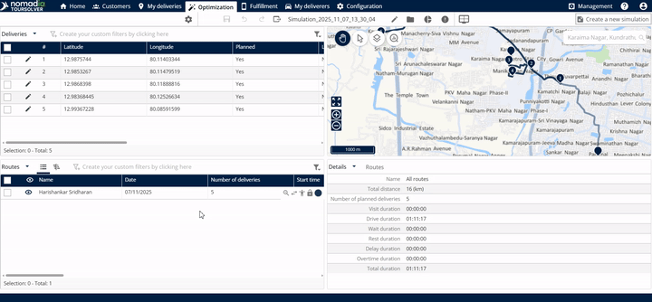
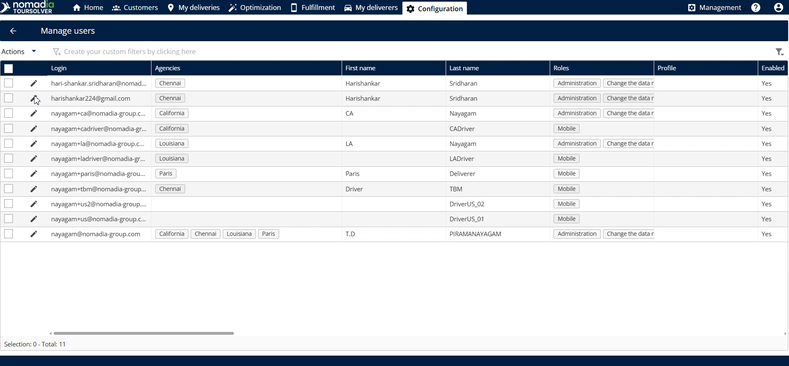
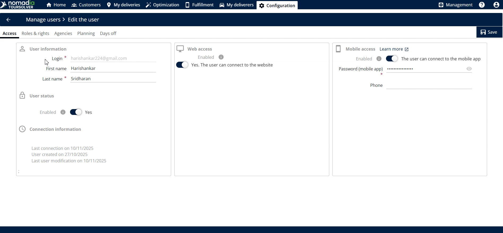
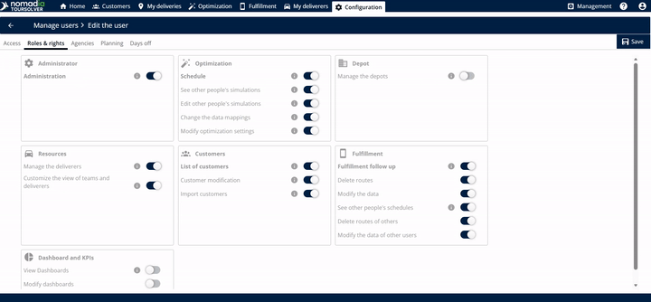
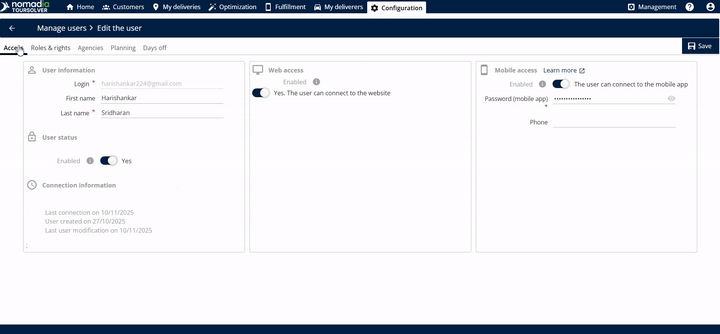
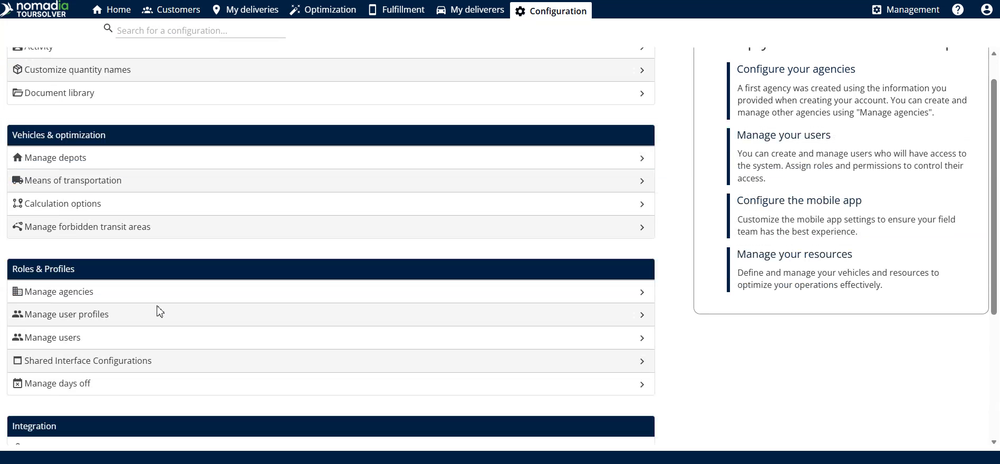
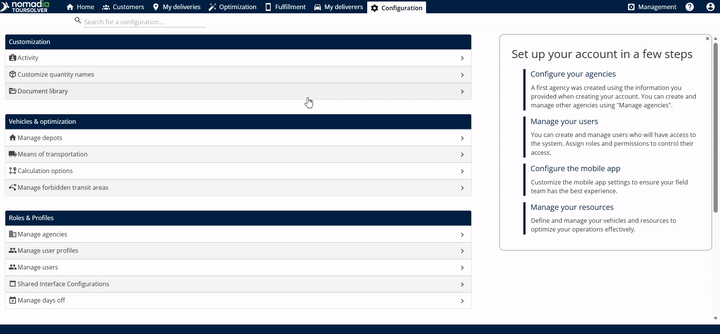
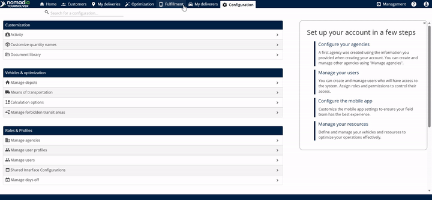
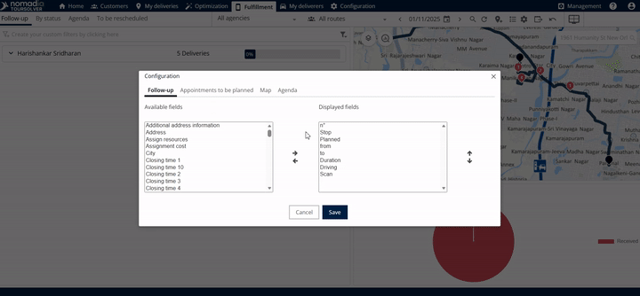
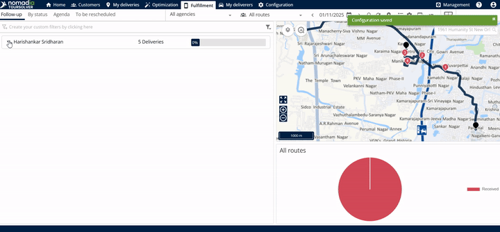

# OperationsandResourceManagement-HowdoIgeolocatemyDeliveryPeople

# Comprehensive User Guide: Tracking Your Delivery People's Location

This guide will show you how to set up access, configure privacy rules, and view the real-time location (geolocation) of your delivery personnel. By following these simple steps, you can confidently manage and monitor your field operations.

***

## 1. Introduction

Being able to locate your delivery team in real-time is crucial for effective resource management. This guide simplifies the process of enabling the necessary access and configuring the mobile application settings so you can easily track your delivery people.

**Goal:** To successfully track the geolocation of your delivery people using the system.

## 2. Getting Started Section

Before starting, the system assumes that you have already set up the delivery people and their planned routes. If these steps are not complete, you must first create the delivery, the delivery people, and the route.

### System Requirements (Access Configuration)

To ensure successful tracking, your delivery personnel must have the correct permissions and access enabled for both the web platform and the mobile application.

**Prerequisite Action**
| Access Type | Description |
| :--- | :--- |
| **Deliverer & Route Setup** | The delivery person and their assigned route must already be created. |
| **Web Access** | Necessary for system login. |
| **Mobile Access** | Required for using the mobile app, which facilitates tracking. |

## 3. Feature Explanations and Benefits

The system offers key features that help you manage security, permissions, and tracking visibility:

*   **Roles and Rights Management:** This is where you grant your delivery people the necessary permissions to operate within the system.
    *   *Benefit:* Ensures your team has all the required capabilities to perform their tasks.
*   **Mobile App Configuration:** This section allows you to fine-tune how the mobile app communicates with the system, including synchronization speed and agenda visibility.
    *   *Benefit:* You control data flow and presentation, enhancing operational efficiency.
*   **Privacy Settings (GDPR Compliance):** You have the power to limit when tracking occurs, adhering to data privacy rules.
    *   *Benefit:* This builds trust and ensures legal compliance by restricting geolocation tracking to only working hours and days.

## 4. Common Tasks: Enabling Geolocation Tracking

This process requires four main steps: navigating to the Optimization area, granting access, configuring permissions, and setting up the tracking view.

### Task 1: Enabling Web and Mobile Access

This step ensures your delivery person can log into both the main system and the mobile application.

1.  **Start in Optimization:** Go to **optimization**.

3.  **Manage Users:** Click on **Manage users**.
    *   *Visual Guidance 1:* A screenshot here showing the 'Manage users' button after clicking 'configuration' would be helpful.

5.  **Enable Access:** Enable the checkboxes for **web access** and **mobile access**.
6.  **Set Password:** Enter the **mobile application password**.

### Task 2: Assigning Roles and Rights

You need to ensure the user has the permissions required to use the mobile tracking features.

### Task 3: Configuring the Mobile Application and Privacy Settings

This step allows you to fine-tune the mobile app experience and ensure privacy compliance.

3.  **Adjust Settings:** Edit general settings, such as:
    *   Number of days reachable in the agenda
    *   Automatic synchronization frequency
    *   Show travel time info
    *   *Visual Guidance 2:* A diagram showing the interface section where 'automatic synchronization frequency' is edited would be useful.
4.  **Set Privacy Rules:** In the mobile app configuration, enable privacy according to relevant rules (like GDPR).

> ⚠️ **Warning:** If you are operating in a region with strict data privacy laws (like GDPR), make sure you enable tracking only during working hours and working days to remain compliant.

### Task 4: Viewing Geolocation in the Fulfillment Tab

Once configuration is complete, you can access the tracking view.

2.  **Select Date:** Enter the specific **date** that has been scheduled for the route you wish to track.
3.  **Open Display Settings:** Click on **settings**.
4.  **Modify Tracking View:** Here you can adjust how the tracking information is displayed, including modifying the:
    *   Available fields
    *   Display fields
    *   Appointments to be planned
    *   **Map**
    *   **Agenda**
    *   *Visual Guidance 3:* A screenshot detailing the 'settings' options showing 'Map' and 'Agenda' fields would clarify customization.

## 5. Productivity Tips

Here are a few tips to maximize your use of the tracking feature:

*   **Customize Your View:** Use the settings menu in the Fulfillment tab (Task 4, step 4) to modify what you see on the screen. If you only need location tracking, make sure the **map** and **agenda** displays are enabled.
*   **Monitor Travel Time:** Ensure you review the mobile app configuration (Task 3) to **show travel time info**. This helps you accurately predict arrival times and manage expectations.
*   **Keep Synchronization Frequent:** If real-time tracking is critical, check the **automatic synchronization frequency** setting in the mobile app configuration. A higher frequency provides more immediate location updates.

***

Geolocation tracking in operations management is like having a digital control tower. Just as air traffic controllers rely on radar to see where planes are located, you rely on this geolocation feature to see where your delivery team is, ensuring every delivery stays on course and on time.

