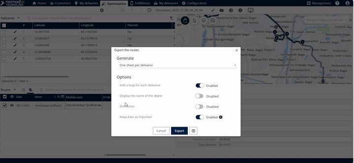
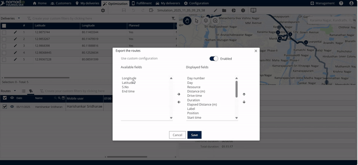
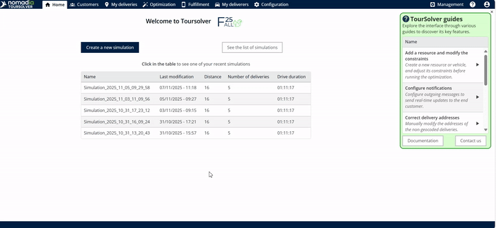
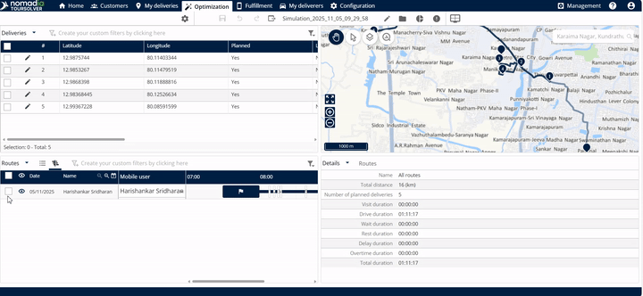
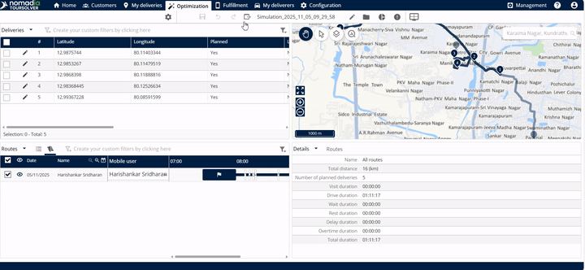
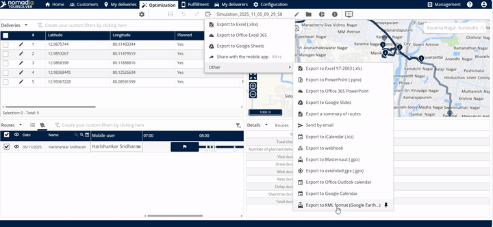
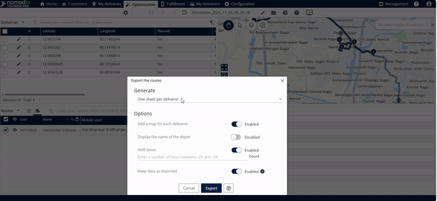
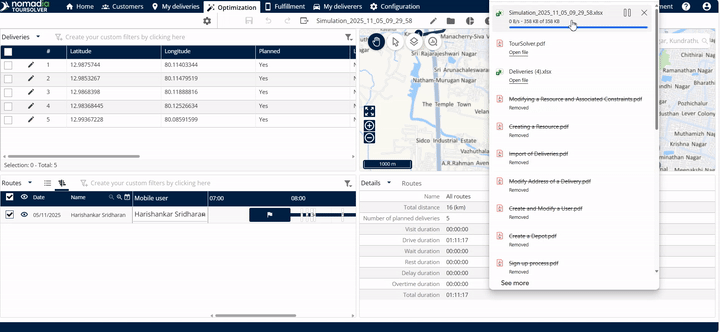

# OperationsandRouteManagement-ExportmyRoutes

# Comprehensive User Guide: Exporting Your Routes

Welcome to the user guide for **[OperationsandRouteManagement-ExportmyRoutes]**! This tool empowers you to easily extract valuable route data and share it using various common formats like Excel, PowerPoint, and more. By following these simple steps, you will quickly gain confidence in managing and exporting your operation reports.

***

## 1. Introduction

This guide will teach you how to select, customize, and export your completed routes using the route management system. Whether you need to share results with a team member via Excel or integrate data into a calendar, this process is designed to be straightforward and effective.

## 2. Getting Started

Since you will be starting the export process directly from the system’s homepage, there are no specific installation or setup steps required.

### Initial Configuration (Setting up Your Export Format)

Before exporting, you can customize how your data looks, especially when exporting to formats like Excel. This ensures the output meets your specific reporting needs.

#### A. Customizing Your Excel Export Settings

When you choose to export to Excel, the system provides several options to tailor the resulting file.

1.  **Select Your Sheet Layout:** Choose how the route data is organized:
    *   **One sheet for all deliverers**.
    *   **One sheet per deliverer**.
    *   *Context:* This helps you decide if you want a consolidated view or detailed reports for individual team members.

    5.  **Data Integrity:** Decide whether to **keep data as imported** or not (Enable or Disable).
        *   *Context:* Enabling this option ensures the exported data remains exactly as it was when originally brought into the system.

💡 **Tip:** These configurations only apply to the Excel export option. Other formats (like PowerPoint or Calendar) will use their standard output settings.

#### B. Selecting Custom Fields (Columns)

You can choose which specific columns (fields) appear in your exported file.

1.  Click on **other** within the configuration window.
2.  You will see a list of **available fields** and **display fields**.

4.  You can also **enable the custom configuration** if needed.
    *   *Context:* When finished, the export file will contain both **standard and mapped columns**.
5.  Click **Save** when you are done customizing the fields.

***

## 3. Feature Explanations and Benefits

The primary benefit of the route export feature is its flexibility, allowing you to quickly share data in formats suitable for various stakeholders.

### Diverse Export Destinations

By clicking the **export option** and selecting **other**, you unlock a wide array of export types.

| Export Feature | Benefit/Usefulness |
| :--- | :--- |
| **Export to Excel** | Ideal for detailed data analysis, calculations, and structured reporting. |
| **Export to PowerPoint / Office 365 PowerPoint / Google Slides** | Useful for quickly generating presentations or summaries for meetings. |
| **Export to Calendar (Office Outlook / Google)** | Allows route schedules and timings to be integrated directly into personal or team calendars. |
| **Export a summary of routes send by email** | Efficiently shares a high-level overview of the route plan with recipients. |
| **Export to Master GPX / Extended GPX** | Necessary for use with specific GPS navigation systems or advanced mapping software. |
| **Export to KML format Google etc.** | Standard format for viewing geospatial data (like routes) in mapping tools (e.g., Google Earth). |
| **Export to Webhook** | Facilitates automated data transfer to other operational systems. |

***

## 4. Common Task: Exporting a Route to Excel

This is the most common task and includes selecting the route, choosing the destination, configuring settings, and finalizing the download.

### Step-by-Step Guide

Follow these steps to successfully export your selected route:

**Step 1: Locate Optimization Section**

1.  Start from the system **home page**.

**Step 2: Select the Route**

1.  **Click the route** that you wish to export.

**Step 3: Initiate the Export Dialogue**

**Step 4: Choose Excel Format**

1.  Since you wish to export the data in Excel, click on **export to Excel**.

**Step 5: Configure and Generate the File**

1.  Review and adjust your initial configuration settings (Sheet Layout, Timings, Data Integrity) as outlined in Section 2.
2.  If you customized fields, ensure you clicked **Save**.
3.  Click **Generate**.

**Step 6: Finalize Export and Open File**

3.  Click **Click here to open the file**.
    *   ⚠️ **Warning:** The sources note that **it will take some time to open** the file, so please be patient.

***

## 5. Productivity Tips

Here are some ways to make the route exporting process more efficient:

*   **Customize Columns for Efficiency (Filtering Data):** If you only need two or three specific data points for a quick analysis, use the **other** option in the configuration menu to remove unnecessary fields. This keeps your report clean and focused, ensuring the export file contains only **standard and mapped columns** that matter most.
*   **Use Calendar Export for Scheduling:** Instead of exporting complex data, use the **export to calendar** option (Office Outlook or Google) to quickly give deliverers their finalized shift timings and route appointments, simplifying daily logistics.
*   **Save Configuration Time:** Once you have set up your desired sheet layout and field selections (like generating **one sheet per deliverer** or including **shift timings**), click **Save**. This allows you to quickly execute the export in the future without re-selecting all the detailed configurations.

***

## Simulated Visual Guidance

To help you visualize the steps, here are descriptions of key interfaces:

### Screenshot 1: Optimization and Export Navigation

| Visual Description | Context |
| :--- | :--- |
| Screen displays the homepage. An arrow points from **Home Page** to a button or tab labeled **Optimization**. Once in the Optimization view, a specific route is highlighted, and an **Export option** is clearly visible at the top. | This confirms the necessary initial path to access the export feature. |
| **GIF Time:** 0:05–0:21 | |

### Screenshot 2: Export Destination Menu

| Visual Description | Context |
| :--- | :--- |
| A drop-down or pop-up menu is displayed after clicking **Export option**. The menu lists several choices, including **export to Excel**, **export to PowerPoint**, **export to calendar**, and the final selection, **other**. | This shows the wide variety of formats available for sharing your route data. |
| **GIF Time:** 0:22–0:49 | |

### Screenshot 3: Excel Configuration Options

| Visual Description | Context |
| :--- | :--- |
| A configuration window for Excel is shown. Checkboxes and selection fields are visible, allowing choices such as: *One sheet for all deliverers* vs. *One sheet per deliverer*, enabling/disabling *Display the name of the deport*, and inputting *Shift timings*. | This is where you customize the structure of your Excel report before generating it. |
| **GIF Time:** 0:54–1:38 | |

### Screenshot 4: Custom Field Selection

| Visual Description | Context |
| :--- | :--- |
| A dual-pane selector is visible, labeled **Available Fields** on the left and **Display Fields** on the right. A right-pointing arrow button (▶) sits between them, used to move fields from the Available list to the Display list. A **Save** button is located near the bottom. | This screen allows advanced users to control exactly which data columns appear in the final export. |
| **GIF Time:** 1:38–2:14 | |