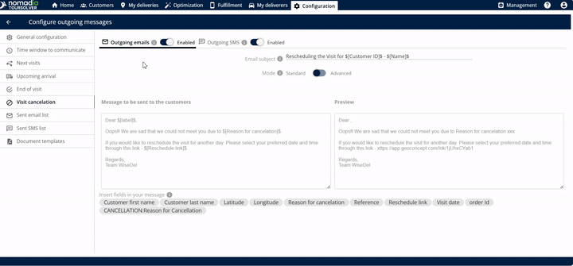
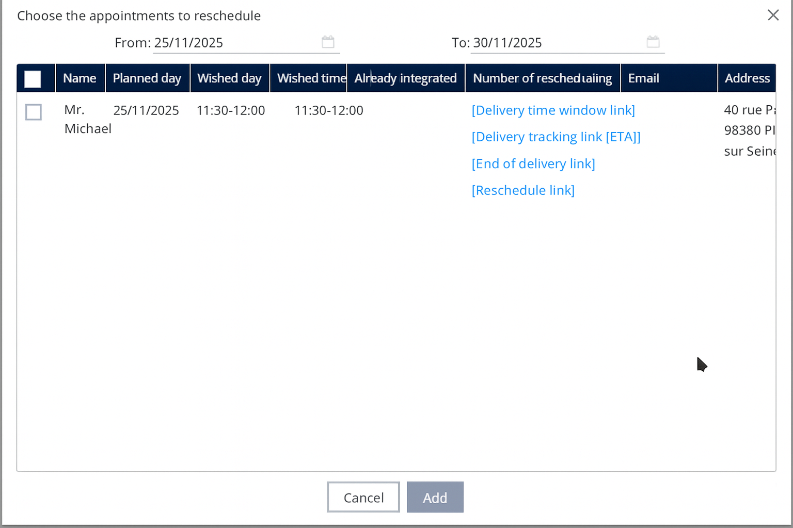

# Visit Cancellation

## 1. Introduction

This process enables you to mark a visit as cancelled while simultaneously triggering an action that prompts the end customer to select a new date and time for rescheduling.

## 2. Initial Configuration&#x20;

Before processing a cancellation, you must ensure that communication channels are active so the customer receives the rescheduling link.

1. **Access the Cancellation Settings:** Click the **visit cancellation** option.
2. **Enable Outgoing Messages:** Ensure both outgoing communication types are turned on:
   * **Outgoing emails**
   * **Outgoing SMS**
3. **Set the Subject (Emails and SMS):** Mention the specific **subject** you want the customer to see.

***

## 3. Feature Explanations and Benefits

This feature streamlines communication and logistics when a delivery attempt fails due to customer unavailability.

| Feature                      | Description                                                                                                                           |
| ---------------------------- | ------------------------------------------------------------------------------------------------------------------------------------- |
| **ETA Link**                 | A link containing the estimated time of arrival (ETA) is automatically created and sent once the delivery completes.                  |
| **Email Subject Editing**    | You can enter and customize the **email subject** so customers immediately know the purpose of the message.                           |
| **Message Body Editing**     | You can freely **edit the message** that will be sent to your customers, allowing for personalized language and important details     |
| **Personalization Tags ($)** | Entering the **dollar symbol** ($) reveals options that you can insert and edit directly into the body of the email, saving you time. |
| **Preview Window**           | Before saving, you can see the **preview** of the exact message that will be sent, ensuring it looks professional and accurate.       |
| **Live Location Tracking**   | The link allows the customer to track the live location of the delivery (or deliverer).                                               |
| **Outgoing Email**           | Option to enable sending the ETA link via email.                                                                                      |
| **Outgoing SMS**             | Option to enable sending the ETA link via text message.                                                                               |

💡 **Tip:** The body of the email automatically includes the **reason for cancellation** and the **rescheduling date** information.

**Insert Personalized Information (Optional)** To include dynamic information (like a customer's name or specific appointment details), enter the **dollar symbol** ($). This will show options you can use to edit the body of the email.

💡 **Tip:** Using personalization tags makes the message feel more direct and professional.

#### Managing Rescheduled Appointments&#x20;

After a visit is canceled, the deliverer must pull the appointment back into the schedule once a new date is selected.

**Finding the Data**

1. **Access Fulfillment:** Go to the **fulfillment tab**.
2. **View Canceled List:** Click on **to be rescheduled**.
3. **Review Data:** You can **see the rescheduled data here**.

<figure><figcaption></figcaption></figure>

**Adding the Appointment Back to the Schedule**

1. **Access Deliverer Tools:** The deliverer should click on **my deliveries**.
2. **Select Appointments:** Click on **add appointments to reschedule**.
3. **List and Add:** **List the data here** and click **add**.

**Expected Outcome:** The rescheduled visits **will be added successfully to the next simulation/optimization**.

<figure><figcaption></figcaption></figure>

## 5. Productivity Tips

* **Always Enable Both:** For maximum customer reach, ensure you **enable the outgoing emails and the outgoing SMS** when setting up the cancellation. This feature is available across multiple channels, ensuring customers can access it even if one method is missed.
* **Use the Preview Feature:** Before clicking **save**, always utilize the feature to **see the preview of the email**. This confirms the cancellation reason and rescheduling link are displayed correctly, preventing communication errors.
* **Track Rescheduled Items:** Regularly check the **fulfillment tab** under **to be rescheduled**. This ensures no canceled visits are missed and keeps your logistics workflow current.
