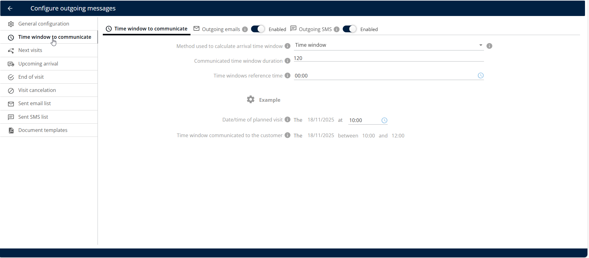
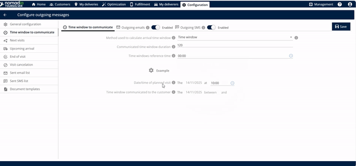
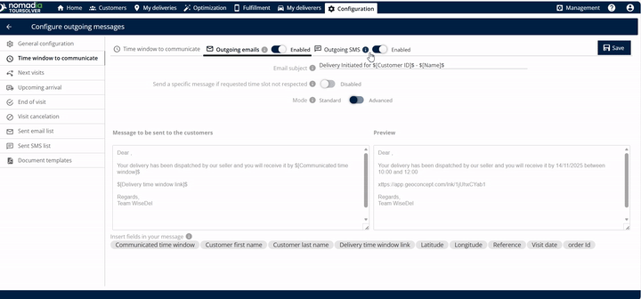
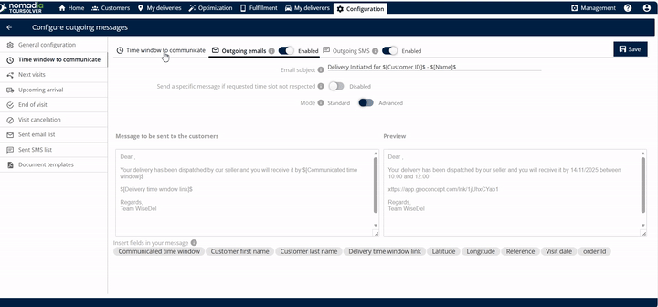
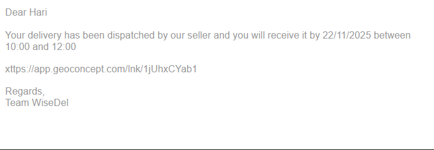

# Time Window to Communicate

## 1. Introduction

The **Time Window to Communicate** feature allows you to define the exact timeframe communicated to your customer regarding an upcoming visit. This calculates the arrival window and manages outgoing communication via email and SMS.

## 2. Initial Configuration

1. Click on **Time Window to communicate**.

<figure><figcaption></figcaption></figure>

***

## 3. Feature Explanations and Benefits

This feature is powerful because it allows you to control exactly how the arrival information is calculated and delivered.

| Feature                      | Description                                                                                                                           |
| ---------------------------- | ------------------------------------------------------------------------------------------------------------------------------------- |
| **ETA Link**                 | A link containing the estimated time of arrival (ETA) is automatically created and sent once the delivery completes.                  |
| **Email Subject Editing**    | You can enter and customize the **email subject** so customers immediately know the purpose of the message.                           |
| **Message Body Editing**     | You can freely **edit the message** that will be sent to your customers, allowing for personalized language and important details     |
| **Personalization Tags ($)** | Entering the **dollar symbol** ($) reveals options that you can insert and edit directly into the body of the email, saving you time. |
| **Preview Window**           | Before saving, you can see the **preview** of the exact message that will be sent, ensuring it looks professional and accurate.       |
| **Live Location Tracking**   | The link allows the customer to track the live location of the delivery (or deliverer).                                               |
| **Outgoing Email**           | Option to enable sending the ETA link via email.                                                                                      |
| **Outgoing SMS**             | Option to enable sending the ETA link via text message.                                                                               |

## 4. Setting Up the Customer Communication Time Window and Notifications

Follow these steps to define the precise time window and enable communication for your customer visit.

1. **Access the Feature:** Click on **Time Window to communicate**.
2. **Define the Calculation Method:**
   * Select the time window method which is used to calculate the arrival time window.

3. **Set the Duration:**
   * Enter the duration for the communicated time window.

💡 \*\*Tip:\*\* Entering \*\*120 minutes\*\* will result in a 2-hour window communicated to the customer (e.g., 10 a.m. to 12 p.m.).

4\. **Select Reference Time:**

5. **Input Planned Visit Details:**
   * Locate the **Date and time of planned visit** field.

6. **Review Calculated Time Window:**
   * The system will display the **time window communicated to the customer**.
   * For example, if you set the duration to 2 hours, the system might calculate the window as 10 a.m. to 12 p.m..
7. **Enable Email Communication:**
   * You can enable the **outgoing emails** option.
   * Review the message that must be sent to the customer below this section.
   * Use the **$** symbol to add keywords and update the default template as needed.

8.  **Enable SMS Communication (Optional):**

    * You can also enable the **outgoing SMS** option.
    * **Insert Personalized Information (Optional)** To include dynamic information (like a customer's name or specific appointment details), enter the **dollar symbol** ($). This will show options you can use to edit the body of the email.

    > 💡 **Tip:** Using personalization tags makes the message feel more direct and professional.

9. **Save Your Settings:**

10. The customer will receive the following email

<figure><figcaption></figcaption></figure>

## 5. Productivity Tips

These tips will help you work more efficiently and ensure smooth communication with your customers:

* **Use the Preview Feature:** Always use the message **preview** option available for both outgoing emails and outgoing SMS. This helps you confirm exactly what the customer will see before you save your settings, ensuring accuracy and clarity.
* **Keep Durations Clear:** When setting the **Communicated Time Window Duration**, choose common increments (like 60 minutes or 120 minutes) that are easy for customers to understand. A clear, defined window prevents confusion.

