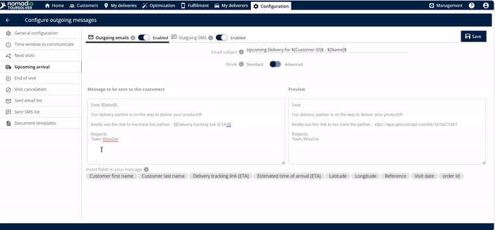
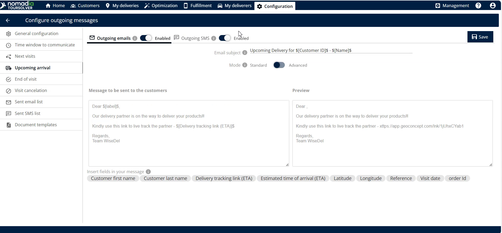
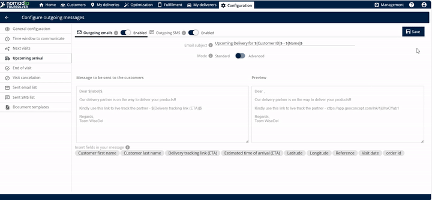
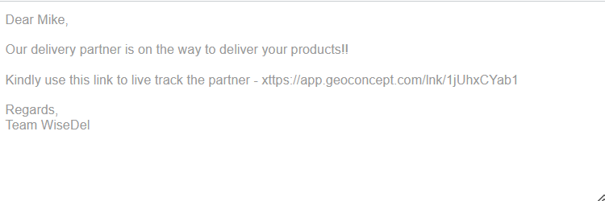

# Upcoming Arrival

## 1. Introduction

The **Upcoming Arrival** feature will enhance customer experience by providing real-time delivery status updates. It automatically generates and sends an Estimated Time Arrival (ETA) link to your customer once the delivery process begins.

**The core benefit is transparency**: When the customer clicks this link, they can **track the live location of the deliverer**.

## 2. Initial Configuration

To start using this feature, you must first navigate to **Upcoming Arrival**

## 3. Feature Explanations with Benefits

The Upcoming Arrival feature enables proactive communication, ensuring customers are ready to receive their items.

| Feature                    | Description                                                                                                          | Benefit for You and Your Customer                                                              |
| -------------------------- | -------------------------------------------------------------------------------------------------------------------- | ---------------------------------------------------------------------------------------------- |
| **ETA Link**               | A link containing the estimated time of arrival (ETA) is automatically created and sent once the delivery completes. | Customers receive crucial timing information instantly.                                        |
| **Live Location Tracking** | The link allows the customer to track the live location of the delivery (or deliverer).                              | Reduces customer anxiety and inbound calls about delivery whereabouts.                         |
| **Outgoing Email**         | Option to enable sending the ETA link via email.                                                                     | Provides a formal, easily accessible communication channel that customers can reference later. |
| **Outgoing SMS**           | Option to enable sending the ETA link via text message.                                                              | Ensures rapid, high-priority communication, reaching customers even without internet access.   |
| **Email Preview**          | Ability to view the content of the communication before saving.                                                      | Allows you to confirm accuracy and professional presentation of the message.                   |

***

## 4. Setting Up Customer Notifications

This is the primary action you will perform: choosing the communication channels for the ETA and live location link.

1. **Access the Configuration:** Navigate to and click on **Upcoming Arrival** (see Initial Configuration steps above).
2. **Enable Email Communication:** Select the option to enable **outgoing emails**.

3. **Enable SMS Communication (Optional):** Select the option to enable **outgoing SMS**.
4. **Insert Personalized Information (Optional)** To include dynamic information (like a customer's name or specific appointment details), enter the **dollar symbol** ($). This will show options you can use to edit the body of the email.

&#x20;      💡 **Tip:** Using personalization tags makes the message feel more direct and professional.

5. **Review the Message Content (Recommended):** To confirm the customer experience, select the option to **see the preview of the email**.
6. **Save Your Settings:** Once you are satisfied with the enabled channels and the preview, click on **save**.

7. The customer will receive the following email.&#x20;

<figure><figcaption></figcaption></figure>

***

## 5. Productivity Tips

Here are a few ways to maximize the effectiveness of your upcoming arrival communications:

* 💡 **Dual Channel Communication:** Consider enabling **both** outgoing emails and outgoing SMS. Using both methods ensures the customer receives the critical ETA information regardless of whether they check their inbox or their text messages first.
* 💡 **Always Preview:** Use the option to **see the preview of the email** before saving configuration changes. This is your chance to verify the message contains the link of the live location as expected.
* ⚠️ **Understanding Trigger Points:** Remember that the ETA link is sent _once the deliverer completes the delivery_ phase (meaning, they are on their way to the customer). Ensure your operational definitions of "completes the delivery" align with when you want the customer to start tracking the live location.

***

