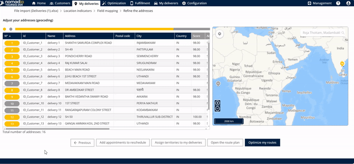

# Visit Cancellation

## 1. Introduction

The Visit Cancellation feature is essential when a **customer is not available while you are delivering a product**. Instead of marking the item as permanently delivered, this process allows you to quickly change the status and provide the customer with the option to **reschedule the delivery**.

When you activate a visit cancellation, the system automatically sends an email to the customer containing the reason for the cancellation and a direct link for them to reschedule.

## 2. Initial Configuration&#x20;

Before processing a cancellation, you must ensure that communication channels are active so the customer receives the rescheduling link.

1. **Access the Cancellation Settings:** Click the **visit cancellation** option.
2. **Enable Outgoing Messages:** Ensure both outgoing communication types are turned on:
   * **Outgoing emails**
   * **Outgoing SMS**
3. **Set the Email Subject:** Mention the specific **email subject** you want the customer to see.

***

## 3. Feature Explanations and Benefits

This feature streamlines communication and logistics when a delivery attempt fails due to customer unavailability.

| Feature                     | Context and Usefulness                                                                         | Benefit to You                                                                                            |
| --------------------------- | ---------------------------------------------------------------------------------------------- | --------------------------------------------------------------------------------------------------------- |
| **Status Change**           | Allows you to change the status from "delivered" to **"not delivered"**.                       | Prevents inaccurate fulfillment records and keeps the order active for rescheduling.                      |
| **Outgoing Email/SMS**      | Provides the customer with the **reason for cancellation** and the **rescheduling link**.      | Immediately informs the customer and empowers them to select a new time, reducing manual follow-up calls. |
| **Email Preview**           | Allows you to **see the preview of the email** before it is sent.                              | Ensures the message body (which contains the reason and rescheduling date) looks professional and clear.  |
| **Fulfillment Tab Listing** | Canceled visits are listed under the **Fulfillment tab** in the **to be rescheduled** section. | Centralizes all appointments needing new dates, making it easier for the deliverer to manage logistics.   |

💡 **Tip:** The body of the email automatically includes the **reason for cancellation** and the **rescheduling date** information.

***

## 4. Notifying the Customer of Cancellation&#x20;

This process sends the notification to the customer, allowing them to reschedule their delivery.

| Step                        | Action and Visual Guidance (GIF)                                                                                                      | Expected Outcome                                                  |
| --------------------------- | ------------------------------------------------------------------------------------------------------------------------------------- | ----------------------------------------------------------------- |
| **1. Set up Communication** | **Enable** both outgoing emails and outgoing SMS, and specify the **email subject**.                                                  | Communication channels are ready to send the cancellation notice. |
| **2. Review Email**         | Review the body of the email, which contains the reason for cancellation and the rescheduling link. **See the preview of the email**. | You confirm the customer will receive clear instructions.         |
| **3. Send Notification**    | Click on **save**.                                                                                                                    | The customer receives the email containing the rescheduling link. |

#### Managing Rescheduled Appointments&#x20;

After a visit is canceled, the deliverer must pull the appointment back into the schedule once a new date is selected.

**Finding the Data**

1. **Access Fulfillment:** Go to the **fulfillment tab**.
2. **View Canceled List:** Click on **to be rescheduled**.
3. **Review Data:** You can **see the rescheduled data here**.

<figure><figcaption></figcaption></figure>

**Adding the Appointment Back to the Schedule**

1. **Access Deliverer Tools:** The deliverer should click on **my deliveries**.
2. **Select Appointments:** Click on **add appointments to reschedule**.
3. **List and Add:** **List the data here** and click **add**.

**Expected Outcome:** The rescheduled visits **will be added successfully to the next simulation/optimization**.

***

## 5. Productivity Tips

* **Always Enable Both:** For maximum customer reach, ensure you **enable the outgoing emails and the outgoing SMS** when setting up the cancellation. This provides redundancy in case the customer misses one communication method.
* **Use the Preview Feature:** Before clicking **save**, always utilize the feature to **see the preview of the email**. This confirms the cancellation reason and rescheduling link are displayed correctly, preventing communication errors.
* **Track Rescheduled Items:** Regularly check the **fulfillment tab** under **to be rescheduled**. This ensures no canceled visits are missed and keeps your logistics workflow current.
