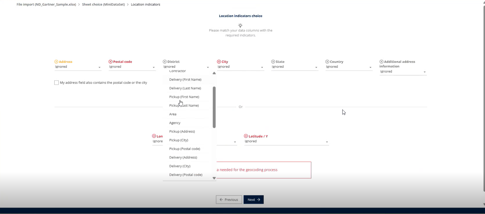

# 12. How do I optimize geocoding in TourSolver?

* **Provide complete and accurate addresses**\
  Ensure each address includes the street name, number, postal code, city, and country. Clean and consistent data improves geocoding results.
*   **Use separate fields for each address component**\
    TourSolver supports two formats for entering address information:

    1. **Structured columns** – Street, Postal Code, City, and Country entered separately.
    2. **Single combined field** – Full address entered in one column.

    👉 To ensure accurate geocoding, **choose one format and use it consistently**. Do not mix structured columns with a combined field in the same dataset, as this may cause errors or inconsistencies in address recognition.
*   **Verify the district information**\
    To improve geocoding accuracy, always **specify the correct district** when entering address data. TourSolver now includes a dedicated **District column**, which helps the system narrow down the search and locate the right area more effectively.

    👉 Using the district field consistently ensures that addresses are matched to the correct geographic zone and reduces errors in route planning.

<figure><figcaption></figcaption></figure>

* **Prefer GPS coordinates when available**\
  If you have latitude and longitude values, include them. TourSolver will use these directly and skip address geocoding, resulting in higher accuracy.
* **Review geocoding quality after import**\
  Use the geocoding quality indicators to identify incorrect or low-quality points and correct them in the data.
*   **Repositioning Option in Mobile App**\
    To improve geocoding quality, TourSolver provides a **Repositioning option** in the mobile application. This feature allows users to **update or adjust the location directly from their mobile device**, ensuring that the recorded position is accurate and aligned with the actual site.

    👉 Using the repositioning option helps correct minor discrepancies and enhances the precision of geocoded addresses in route planning.
