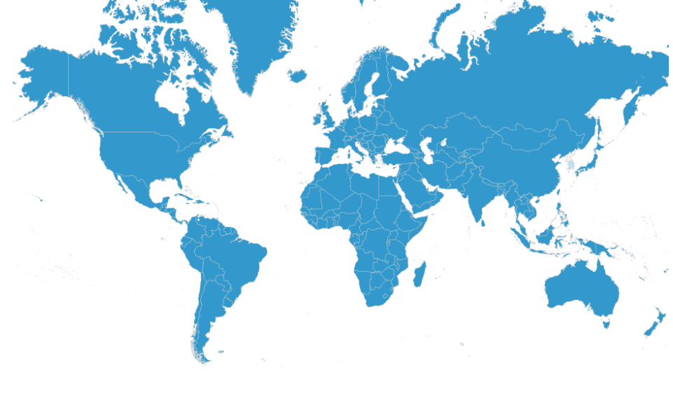

# 17. Which countries are covered by TourSolver?

As of **May 2, 2018 (version 5.0)**, TourSolver provides routing and optimization coverage across **approximately 230 countries**, representing **over 7.2 billion people**.\
With recent additions such as **Bangladesh, Bhutan, Maldives, Nepal, Pakistan, and Sri Lanka**, TourSolver now covers **almost the entire planet**.

<figure><figcaption></figcaption></figure>

Coverage is organized by region, and some regions include **geographical sectorization** (available in the **Premium version**). Below is the complete list of covered countries and their Premium availability status.

***

### **🌍 Europe**

**Geographical sectorization available in Premium**

ALBANIA, GERMANY, ANDORRA, ARMENIA, AUSTRIA, AZERBAIJAN, BELARUS, BELGIUM, BOSNIA AND HERZEGOVINA, BRAZIL, BULGARIA, CYPRUS, CROATIA, DENMARK, SPAIN, ESTONIA, RUSSIAN FEDERATION, FINLAND, FRANCE, GEORGIA, GREECE, GREENLAND, HUNGARY, ISLE OF MAN, FAROE ISLANDS, IRELAND, ICELAND, ITALY, KAZAKHSTAN, KYRGYZSTAN, LATVIA, LIECHTENSTEIN, LITHUANIA, LUXEMBOURG, MALTA, MONTENEGRO, NORWAY, UZBEKISTAN, NETHERLANDS, POLAND, PORTUGAL, NORTH MACEDONIA, MOLDOVA, CZECH REPUBLIC, ROMANIA, UNITED KINGDOM, SERBIA, SLOVAKIA, SLOVENIA, SWEDEN, SWITZERLAND, TAJIKISTAN, TURKMENISTAN, TURKEY, UKRAINE.

***

### **🌍 Africa & Middle East**

**Geographical sectorization NOT available in Premium**

Afghanistan, South Africa, Algeria, Angola, Saudi Arabia, Bahrain, Gaza Strip, Benin, Botswana, Burkina Faso, Burundi, Cameroon, Cape Verde, Comoros, Democratic Republic of the Congo, Republic of the Congo, Ivory Coast, Djibouti, Egypt, United Arab Emirates, Eritrea, Ethiopia, Gabon, Gambia, Ghana, Guinea, Equatorial Guinea, Guinea-Bissau, Iraq, Iran, Israel, Jordan, Kenya, Kuwait, Lesotho, Lebanon, Liberia, Libya, Madagascar, Malawi, Mali, Morocco, Mauritius, Mauritania, Mayotte, Mozambique, Namibia, Niger, Nigeria, Oman, Uganda, Palestine, Qatar, Central African Republic, Réunion, Rwanda, Western Sahara, Sao Tome and Principe, Senegal, Seychelles, Sierra Leone, Somalia, Sudan, South Sudan, Saint Helena–Ascension–Tristan da Cunha, Swaziland (Eswatini), Syria, Tanzania, Chad, Togo, Tunisia, Yemen, Zambia, Zimbabwe.

***

### **🌍 North & Central America**

**Geographical sectorization available in Premium**

Bahamas, Belize, Bermuda, Canada, Costa Rica, Cuba, Cayman Islands, Dominican Republic, Guatemala, Honduras, Haiti, Jamaica, Mexico, Nicaragua, Panama, Puerto Rico, El Salvador, Saint Pierre and Miquelon, Turks and Caicos Islands, United States, British Virgin Islands, U.S. Virgin Islands.

***

### **🌍 South America & the Caribbean**

**Geographical sectorization NOT available in Premium**

Aruba, Anguilla, Argentina, Antigua and Barbuda, St. Eustatius, Saba, Bonaire, Saint Barthélemy, Bolivia, Brazil, Barbados, Chile, Colombia, Curaçao, Dominica, Ecuador, Falkland Islands, Guadeloupe, Grenada, Guyana, Guyane, St. Kitts and Nevis, Saint Lucia, Saint Martin, Montserrat, Martinique, Peru, Paraguay, South Georgia and South Sandwich Islands, Suriname, Sint Maarten, Trinidad and Tobago, Uruguay, Saint Vincent and the Grenadines, Venezuela.

***

### **🌍 Asia**

**Geographical sectorization NOT available in Premium**

Bangladesh, Bhutan, China _(available only from within China)_, India, Maldives, Nepal, Pakistan, Sri Lanka, Japan.

***

### **🌍 Southeast Asia**

**Geographical sectorization NOT available in Premium**

Brunei, Guam, Hong Kong, Indonesia, Cambodia, Laos, Macau, Myanmar, Mongolia, Mariana Islands, Malaysia, Philippines, Paracel Islands, Palau, Papua New Guinea, Singapore, Solomon Islands, Spratly Islands, Thailand, East Timor, Vietnam, Taiwan.

***

### **🌍 Oceania**

**Geographical sectorization NOT available in Premium**

Australia, Micronesia, Fiji, Cook Islands, Marshall Islands, Kiribati, Nauru, Niue, New Caledonia, New Zealand, French Polynesia, Samoa, American Samoa, Tokelau, Tonga, Tuvalu, Vanuatu, Wallis and Futuna.

***

### **🌍 Countries Not Covered**

* **North Korea**
* **South Korea**
