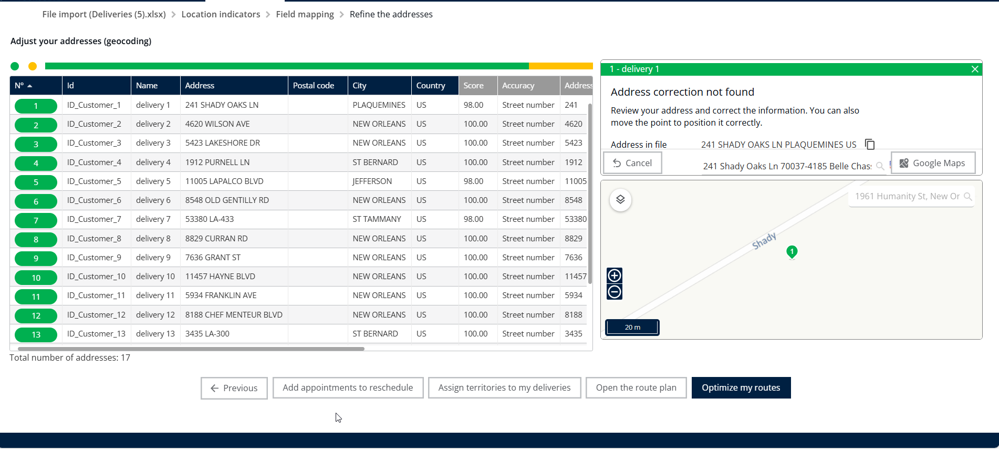

# Modify Address of a Delivery

## 1. Introduction

Welcome! This guide shows you exactly how to update the address for an existing delivery and ensure your routes are instantly updated

## 2. Initial Configuration

* **Set Notification Preferences**
  * Turn on the **notification toggle** so customers receive SMS/email when an address is changed.
* **Ensure Data Accuracy**
  * Enter customer phone numbers in **international format** and use the **District column** to improve geocoding precision after modifications.

## 3. Feature Explanations and Benefits

The core benefit of the address modification feature is its ability to ensure accurate and efficient delivery routing when details change.

<table data-header-hidden><thead><tr><th valign="top"></th><th valign="top"></th></tr></thead><tbody><tr><td valign="top">Feature</td><td valign="top">Context and Benefit</td></tr><tr><td valign="top">Address Modification</td><td valign="top">Allows you to quickly correct or update the location of a specific delivery using the Address field</td></tr><tr><td valign="top">Re-optimization</td><td valign="top">Once you save the new address, the system automatically recalculates the optimal route. This means the new distance and the travel time will be recalculated instantly after the re-optimization.</td></tr></tbody></table>

## 4. Update an Existing Delivery Address and Recalculate the Route

This procedure walks you through selecting a delivery, updating its location, and running a re-optimization to display the new route.

**Access the Optimization Screen**

1. From the **home page**, Click on **Optimization**.

<figure><figcaption></figcaption></figure>

**Select the Delivery to Edit**

2. Select any one delivery details.
3. Click on the **Edit** button.

<figure><figcaption></figcaption></figure>

**Enter the New Address**

4. Enter the **new address** in the Address field.

**Locate and Confirm the New Address**

5. Scroll down.
6. Click on **Locate**

<figure><figcaption></figcaption></figure>

7. Select the **new address** that you entered from the suggested options

<figure><figcaption></figcaption></figure>

**Save the Address Change**

8. Click on **Edit**.

<figure><figcaption></figcaption></figure>

**Start the Route Re-optimization**

9. Click on **Deliveries**
10. Click on **Optimize**

<figure><figcaption></figcaption></figure>

**Expected Outcome**

After saving and optimizing, you will see immediate results:

* The new route and details will be displayed clearly on the map.
* The system has recalculated the new distance and travel time.

<figure><figcaption></figcaption></figure>

### Alternative Method: Modify Multiple Addresses from the _My Deliveries_ Page

1. Go to **My Deliveries**.
2. Select **Deliveries** to view your list of orders.
3. Open the **Address Adjustment** option on the map.
4. Modify the addresses as needed.

<figure><figcaption></figcaption></figure>

