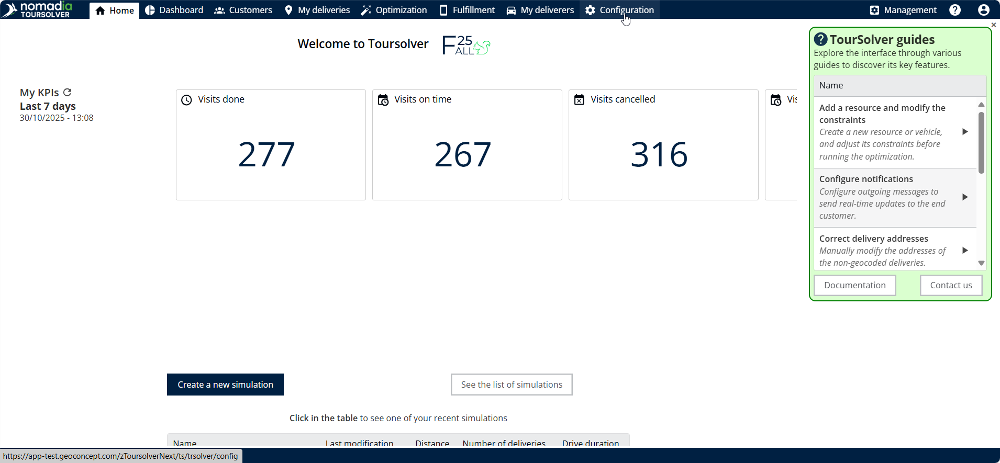
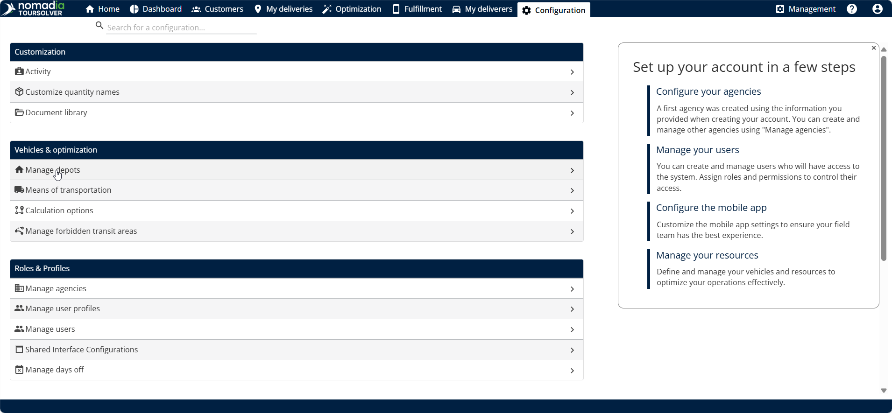
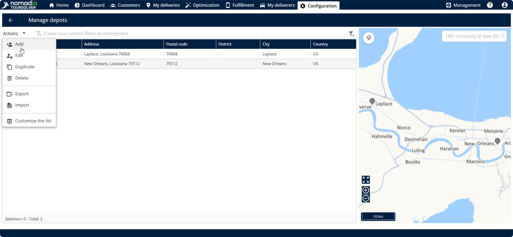
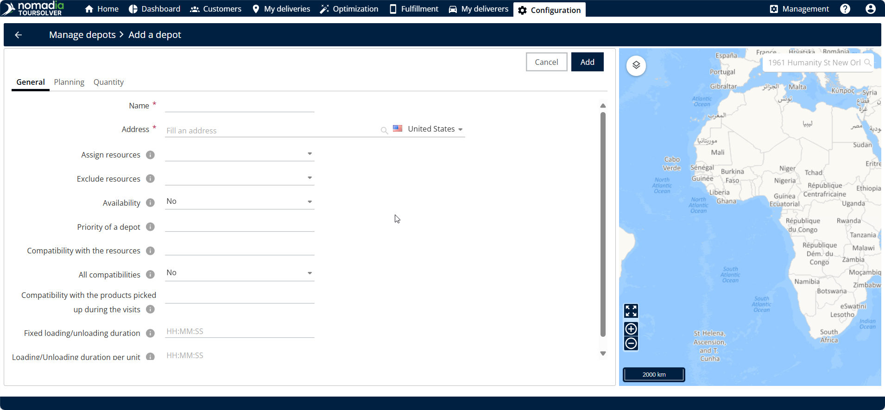
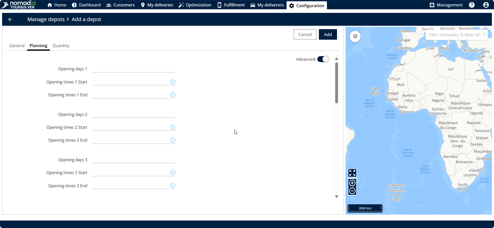
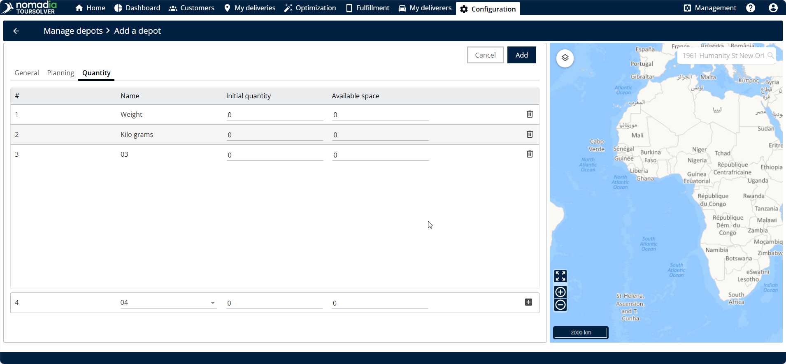
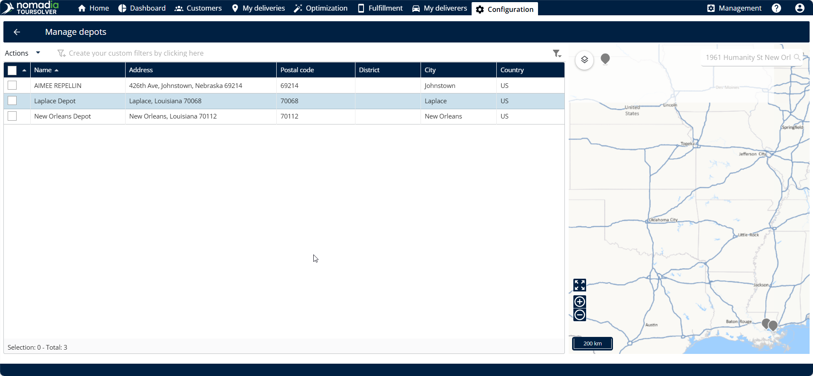
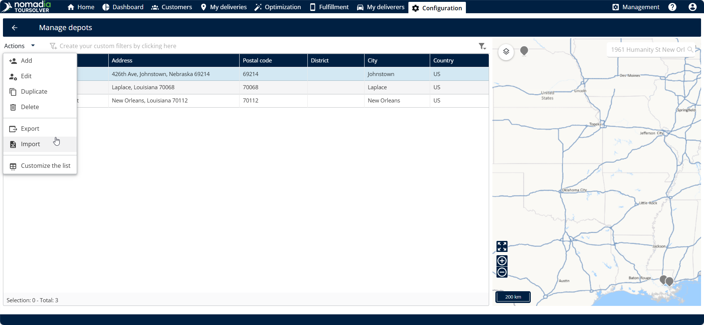
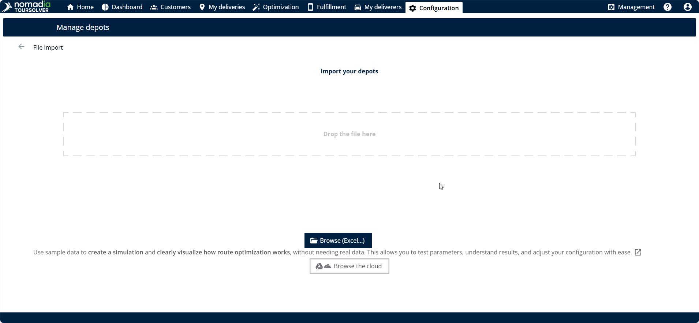

# Create a Depot

### 1. Creating and Managing Depots

A Depot is essentially a location—a warehouse, service center, or hub—that you need to manage for scheduling and resource allocation. By following this guide, you will learn exactly how to create these important locations efficiently and accurately.

### 2. Navigating to Manage Depots

To begin managing or creating a Depot, follow these steps:

1. Access the **TourSolver web application**.

<figure><figcaption></figcaption></figure>

2. From the **Actions menu**, click **Manage Depots**

<figure><figcaption></figcaption></figure>

***

### 3. Understanding Depot Details

When you create a new Depot, you will fill out details across three main sections: **General**, **Planning**, and **Quantity**. Each section controls a different aspect of how the Depot functions within your scheduling and resource planning.

#### A. General Section

This section handles the basic identification and core rules for your Depot.

| Field/Constraint | Purpose/Benefit                                                                                                     |
| ---------------- | ------------------------------------------------------------------------------------------------------------------- |
| **Name**         | Identifying label for the Depot.                                                                                    |
| **Address**      | Physical location of the Depot.                                                                                     |
| **Constraints**  | Rules that govern how the Depot operates, such as **Assign Resources**, **Explore Resources**, or **Availability**. |

#### B. Planning Section

This section defines when the Depot is operational.

* You can specify the **opening days**.
* You can set the **opening time**.
* You can set the specific **start and end time**.
* You have the option to edit **multiple opening days** from this location.

#### C. Quantity Section

This section defines the capacity and inventory available at the location.

* You will edit the **initial quantity**.
* You can define the **available space**.

***

### 4. Creating a New Depot

The most common task is adding a brand new Depot. This requires moving through the three detailed sections described above.

#### Adding a New Depot

1. From the **Actions** menu, click **Add**.

<figure><figcaption></figcaption></figure>

2.  In the **General** section, enter the required basic information.

    * Input the **Name** and **Address**.

    <figure><figcaption></figcaption></figure>
3. Edit the scheduling details.

* &#x20;Click on **Planning**
* Adjust the **opening days** and **opening time**.
* Define the **start and end time**.

&#x20;  **Tip :** You can also edit **multiple opening days** from this screen to save time when setting complex   &#x20;

&#x20;  schedules.

<figure><figcaption></figcaption></figure>

4. To add or edit quantity details, click the **plus symbol** located at the bottom right corner.
5.  Update the inventory details.

    * Edit the **initial quantity**.

    <figure><figcaption></figcaption></figure>

6. Depot has been created successfully

<figure><figcaption></figcaption></figure>

***

### 5. Productivity Tips

To manage your Depots efficiently, especially if you have à large number of locations to configure, leverage the bulk action tools.

#### 6. Bulk Import or Export Depots

You can easily manage multiple Depot entries at once using the import and export functions.

1. On the main Depot management screen, click the **Actions** menu.
2. Click on **Export** to download the file.

<figure><figcaption></figcaption></figure>

3. Click **Import**, then select **Browse Excel** to choose a file and import it, or simply **drag and drop** your file into the upload area.

<figure><figcaption></figcaption></figure>

> 💡 **Tip**: Using the **Export** feature first can be helpful if you want to create a template to correctly format the data before performing a bulk **Import** of new Depots.
