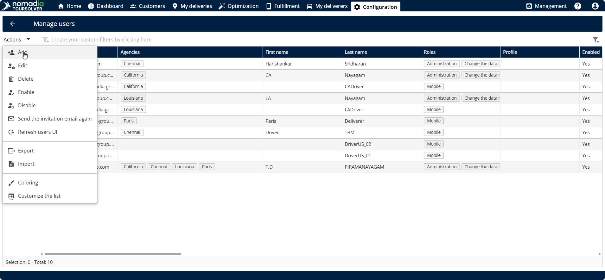
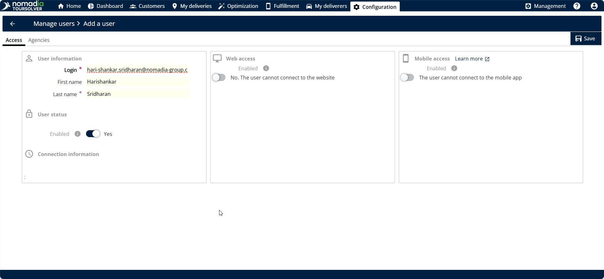

# Create and Modify a User

### 1. Introduction

This guide provides step-by-step instructions for setting up new team members and updating the details, roles, or schedules of current users. By following these simple steps, you will be able to manage access settings confidently and efficiently!

### 2. Navigating to Manage Users

The first step for creating or modifying any user is accessing the main configuration area from the homepage.

#### Access to Manage Users Section

To begin creating or modifying a user, follow these steps:

1. From the **homepage**, go to the **configuration**.
2. Click on **Manage Users**.&#x20;

<figure><figcaption></figcaption></figure>

3. Click on **Actions**.&#x20;
4. Click on **Add**.&#x20;

<figure><figcaption></figcaption></figure>

#### &#x20; **Feature Explanations and Benefits**

When you create or modify a user, you will interact with several key sections to define their access and scheduling.

| Section              | Purpose (Context)                                                                                             | Key Actions                                                                       |
| -------------------- | ------------------------------------------------------------------------------------------------------------- | --------------------------------------------------------------------------------- |
| **Access**           | Defines the basic identity and login permissions (web and mobile) for the user.                               | Enter login ID, names, and set the initial password for mobile user               |
| **Roles and Rights** | Determines what the user is allowed to see and do within the application (e.g., administrator, optimization). | Enable necessary roles and rights, such as **administrator** or **optimization**. |
| **Agencies**         | Assigns the specific agencies the user is responsible for or needs access to.                                 | Select required agencies and use the **right arrow** to assign them.              |
| **Planning**         | Allows you to plan the slot time for the user.                                                                | Click the day and timing to set the slot time, then tap **update**.               |
| **Days Off**         | Enables you to pre-plan and record any days off the user intends to take.                                     | Enter the **from date** and **to date** for the planned time off.                 |

**Note**: Planning & days off will be accessible for the mobile user. Roles & rights will be accessible only for the web user

### 3. Creating Users

You have the ability to create a user completely from scratch or efficiently modify an existing user by using their details as a template.

#### Create a User from Scratch

This is necessary when onboarding a new employee who requires a unique login ID and defined roles.

1. After navigating to the **Add** screen, confirm you are creating a user from scratch.
2. &#x20;First, let's see how to create the user from the scratch. Click on **OK** – Begins new user creation.

<figure><figcaption></figcaption></figure>

3. **Fill in Access Details:** In the **Access** section, enter the required information:

* **Login ID**
* **First Name**
* **Last Name**

4. **Set Access Type and Password:**

* For web access, **toggle** the **Web Access** option.
* For mobile access, **toggle** the **Mobile Access** option.
* Enter the password.&#x20;

💡 **Tip:** You can toggle both the **Web Access** and **Mobile Access** options at the same time if the user requires both. ⚠️ **Warning (Password Requirement):** The password must contain **8 characters**, including **one numeric** character and **one special character**.

<figure><figcaption></figcaption></figure>

5. **Define Roles and Rights:** In the **Roles and Rights** section, enable all necessary roles, such as **administrator**, **optimization**, or **depot**. In the roles and rights, enable all the roles and rights such as administrator, optimization, depot etc.&#x20;
6. **Assign Agencies:** In the **Agencies** section, click on the agencies you need to assign, and then Click the **right arrow** to move them into the assigned list. &#x20;

<figure><figcaption></figcaption></figure>

7. **Plan Slot Time:** In the **Planning** section, Click the **day and timing** to set the desired slot time, and then click **update**.

<figure><figcaption></figcaption></figure>

8. **Schedule Days Off (Optional):** In the **Days Off** section, you can plan future time off:

* Click the **plus icon** on the right side.
* Enter the **from date** and the **to date** for the day off.
* Click on **Add**.

<figure><figcaption></figcaption></figure>

9. **Save the User:** After filling in all required information, Click on **Save** to finalize the creation.&#x20;

<figure><figcaption></figcaption></figure>

&#x20;   **Expected&#x20;**_**Outcome:**_ User has been created successfully&#x20;

<figure><figcaption></figcaption></figure>

#### Modify an Existing User

You can easily update an existing user's information, such as their roles, agencies, or schedule, without starting over.

1. **Select Existing User:** **Toggle** **Yes** in the **create from an existing user** section.&#x20;
2. **Choose the User:** Select the specific user you want to modify, and then Click on **OK**.&#x20;

<figure><figcaption></figcaption></figure>

3. **Modify Information:** Go through the different sections (Access, Roles and Rights, Planning, etc.) and modify the existing information as needed.
4. **Save Changes:** Once you have updated the necessary information, Click on **Save** to complete the modification.&#x20;

<figure><figcaption></figcaption></figure>

### 4. Productivity Tips

Here are a few useful tips and warnings to ensure your user management process goes smoothly:

* 💡 **Dual Access:** Remember that you can enable both **web access** and **mobile access** simultaneously for a user, giving them flexibility in how they interact with the system.
* ⚠️ **Password Clarity:** When setting a password, make sure it meets the security criteria: it must be **8 characters** long and include at least **one numeric** character and **one special character**.
* ⚠️ **Avoid Duplicate Emails:** If you try to enter an email address that is already in use by another user, the system will display an error message stating that **"the email id is already used"**. You will need to use a unique email address to proceed.
