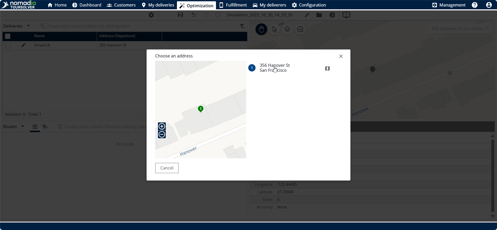
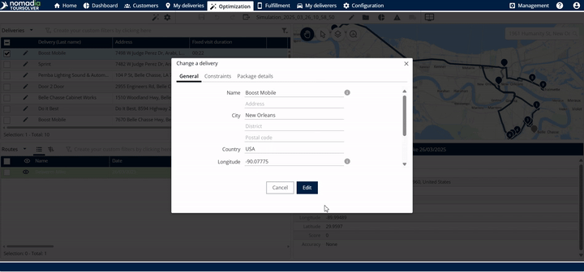
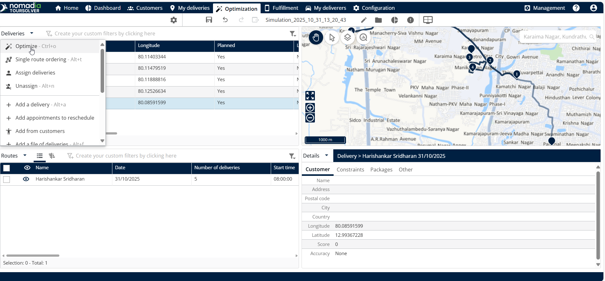
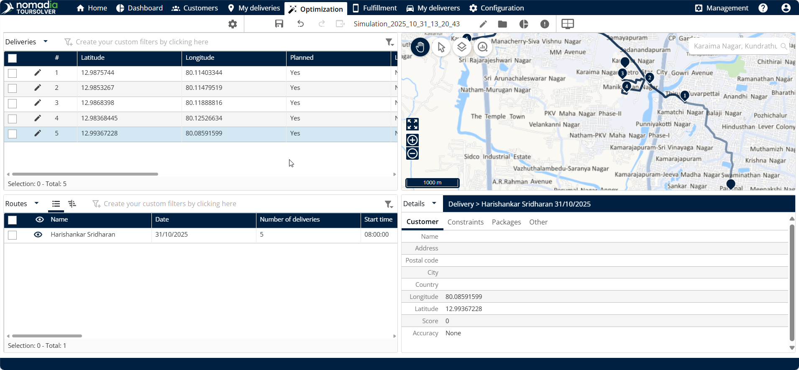

# Modify Address of a Delivery

## 1. Introduction

Welcome! This guide shows you exactly how to update the address for an existing delivery and ensure your routes are instantly updated&#x20;

***

## 2. Feature Explanations

The core benefit of the address modification feature is its ability to ensure accurate and efficient delivery routing when details change.

| Feature                  | Context and Benefit                                                                                                                                                                                    |
| ------------------------ | ------------------------------------------------------------------------------------------------------------------------------------------------------------------------------------------------------ |
| **Address Modification** | Allows you to quickly correct or update the location of a specific delivery using the **Address field**                                                                                                |
| **Re-optimization**      | Once you save the new address, the system automatically recalculates the optimal route. This means the **new distance and the travel time will be recalculated** instantly after the re-optimization.  |

***

## 3. How to Modify a Delivery Address and Update the Route

If you need to change a delivery address because of an error or a customer request, follow these simple steps to ensure your routes are immediately adjusted.

### Update an Existing Delivery Address and Recalculate the Route

This procedure walks you through selecting a delivery, updating its location, and running a re-optimization to display the new route.

1.  **Access the Optimization Screen**

    * From the home page, Click on **Optimization**.

    <figure><figcaption></figcaption></figure>
2.  **Select the Delivery to Edit**

    * Select any one delivery details.
    * Click on the **Edit button**.

    <figure><figcaption></figcaption></figure>

3. **Enter the New Address**
   * Enter the new address in the **Address field.**&#x20;
4.  **Locate and Confirm the New Address**

    * Scroll down.
    * Click on **Locate**

    <figure><figcaption></figcaption></figure>

    * Select the new address that you entered from the suggested options&#x20;

    <figure><figcaption></figcaption></figure>
5.  **Save the Address Change**

    * Click on **Edit**.

    <figure><figcaption></figcaption></figure>
6. **Start the Route Re-optimization**
   * Click on **Deliveries**&#x20;
   * Click on **Optimize**.

<figure><figcaption></figcaption></figure>

### Expected Outcome

After saving and optimizing, you will see immediate results:

* The new route and details will be displayed clearly in the map.&#x20;
* The system has recalculated the new distance and travel time.&#x20;

<figure><figcaption></figcaption></figure>
