# Rename a Quantity of a Vehicle

### 1. Introduction

Renaming a vehicle quantity helps you personalize your system terminology. By changing these names, you ensure clarity and consistency when viewing vehicle capacities and importing new delivery information. You are learning how to successfully rename the quantity of a vehicle.

### 2. Feature Explanations and Benefits

The ability to customize quantity names provides a significant benefit by displaying user-defined names in two key areas:

* **Vehicle Capacity View:** After renaming, the new names are visible when you check a vehicle’s capacity details. This allows you to quickly verify what capacity limitations are assigned to your fleet.
* **Delivery Import Screen:** The new names are displayed when you import new deliveries. Specifically, they appear when you select **Show All** under the quantity section during the import process, ensuring correct data mapping.

### 3. Common Tasks with Detailed Steps

This section details the primary task: renaming the quantity, and how to verify the change afterward.

#### 1. Renaming a Vehicle Quantity

Follow these simple steps to update the quantity names in your system:

1. **Access Configuration**

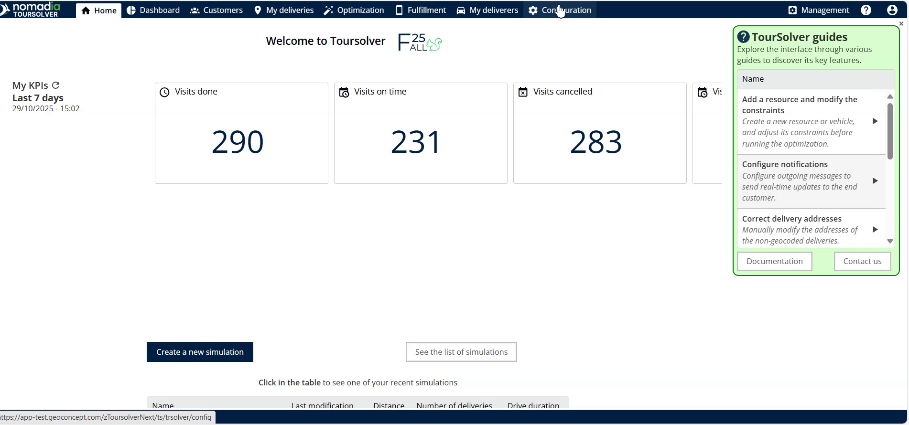

2. **Navigate to Customization**

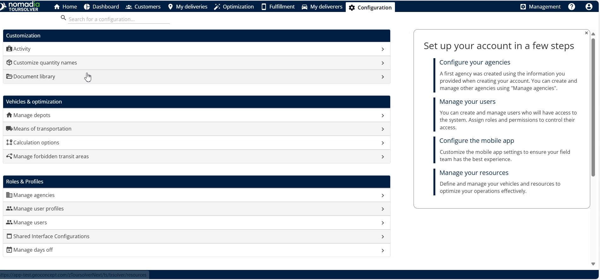

3. **Rename the Quantity**

4. **Save Your Changes**

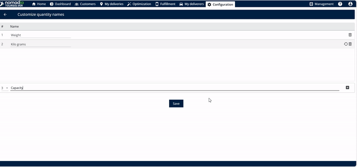

***

#### Verifying New Names in Vehicle Capacities

You should check a vehicle's details to confirm the new name is displayed correctly:

1. **Go to My Deliverers**

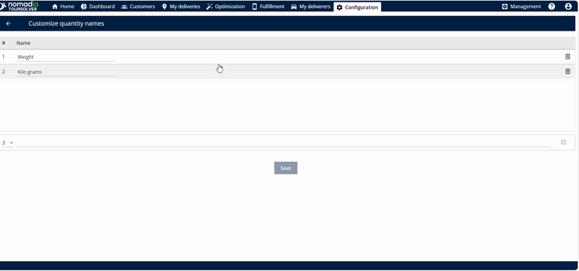

2. **Edit a Vehicle**

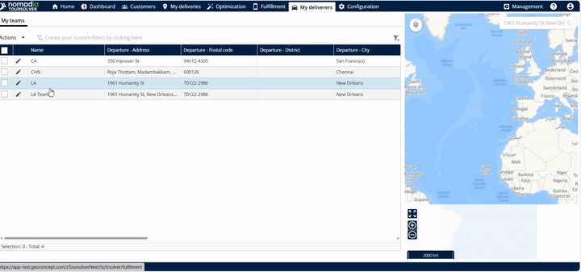

3. **View Capacities**

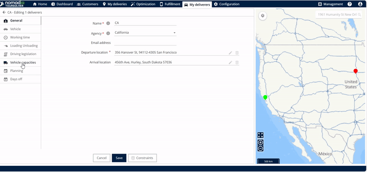

4. **Confirm the Name**

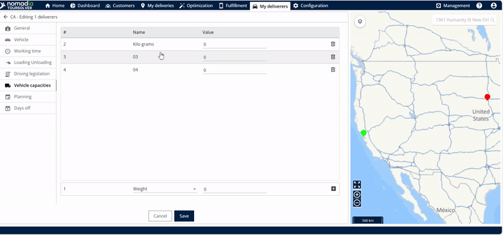

***

#### Verifying New Names during Delivery Import

The renamed quantities are also visible when you import deliveries:

1. **Go to My Deliveries**

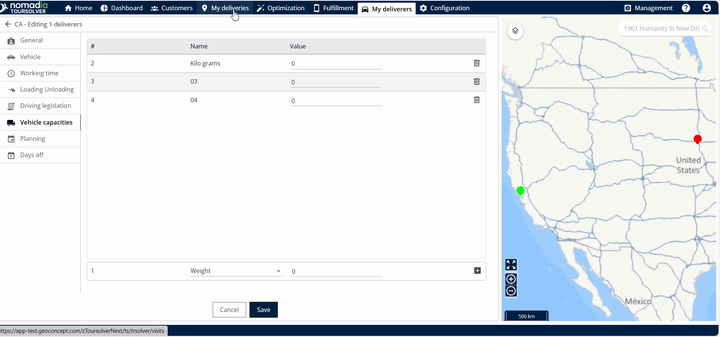

2. **Start Import**

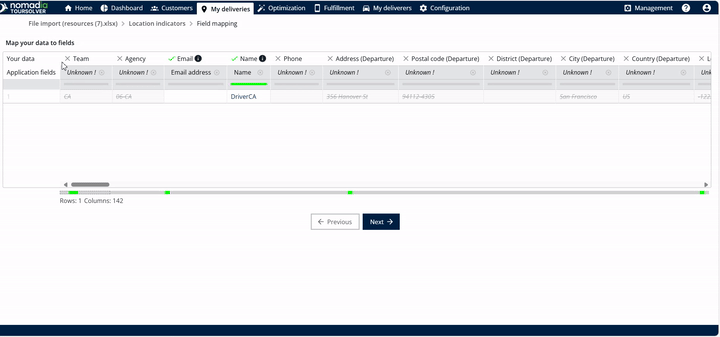

3. **Address Unknown Fields**

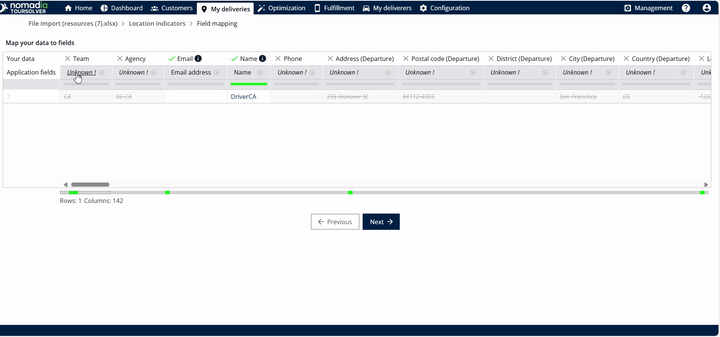

4. **Show All Quantities**

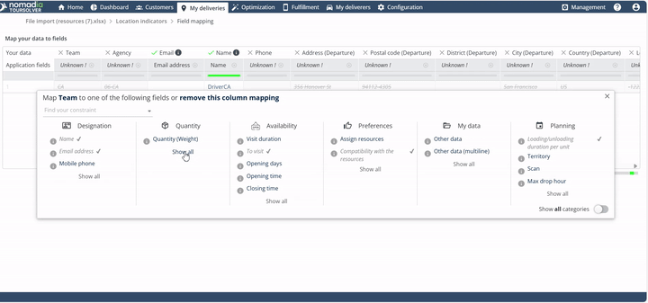

5. **Confirm the New Name**

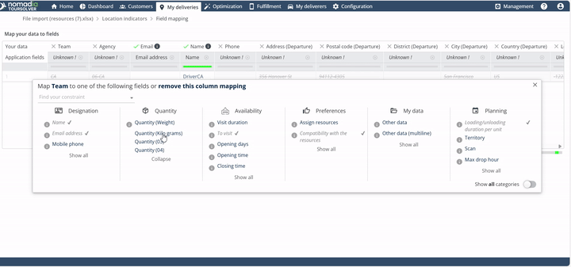

### 5. Productivity Tips

💡 **Tip: Immediate Verification is Key:** After saving your renamed quantity, take a moment to immediately verify the change both in **Vehicle Capacities** and by checking a pending delivery import This ensures your changes propagated correctly across the system.

💡 **Tip: Keep it Simple:** Use clear, concise names that are easy for everyone on your team to understand. Since the new name will be displayed in multiple areas, choosing accessible language prevents confusion.

⚠️ **Warning: Ensure Complete Renaming** The source indicates you can "rename the quantity" (singular). Ensure you have updated all necessary fields before Clicking **Save** to avoid having to return to the customization menu multiple times.
